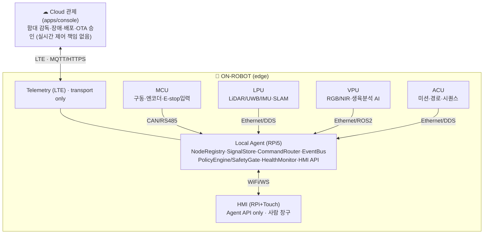
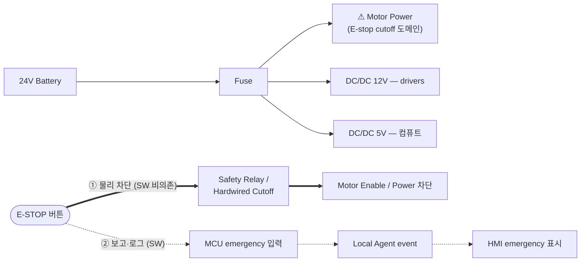
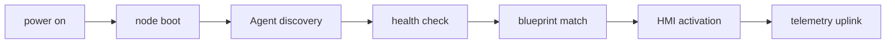
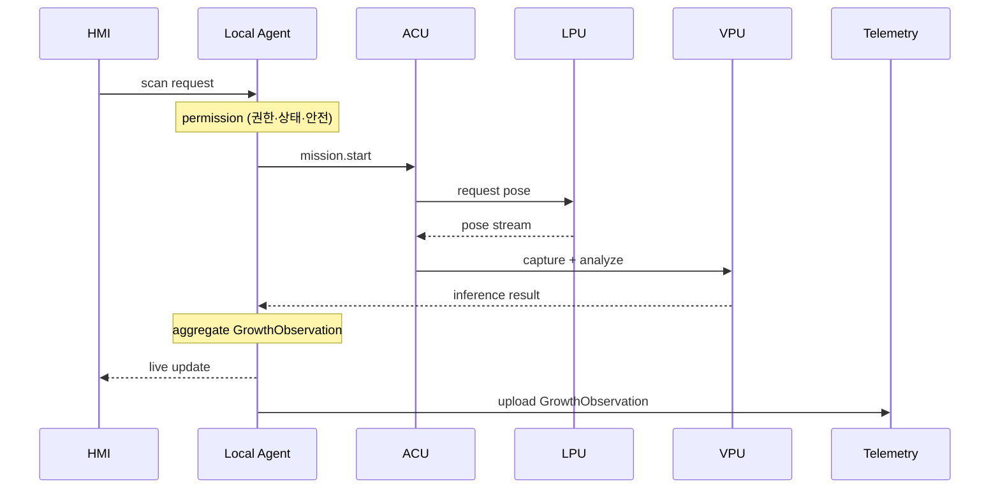
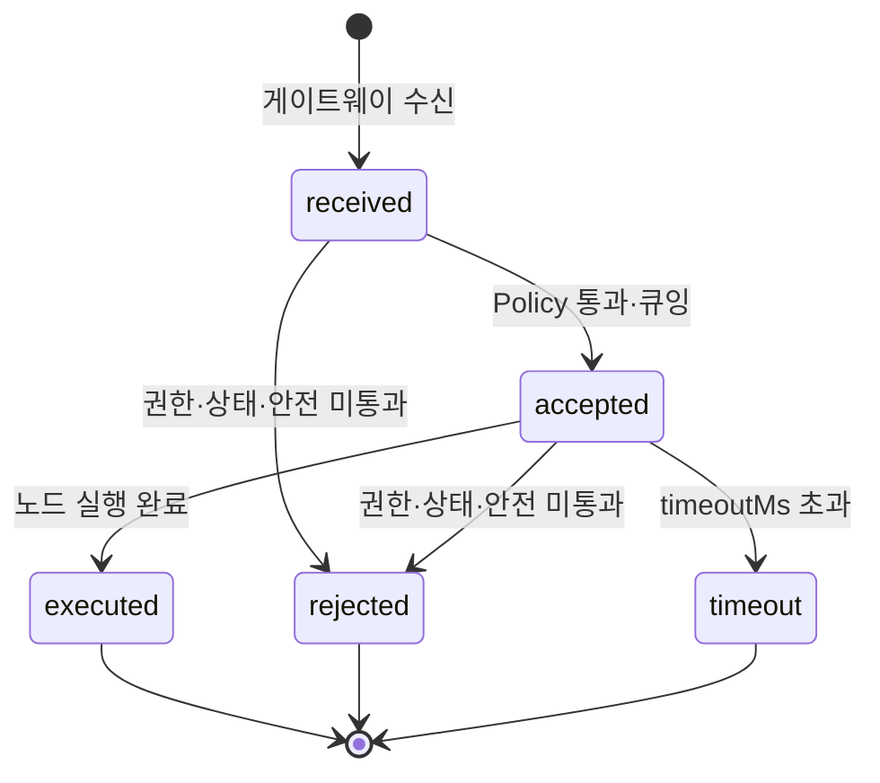

# 생육분석 로봇 SDV 레퍼런스 리그 — 산업용 분산 아키텍처 설계 (1차 산출물)

> **온로봇 SDV 개발 벤치.** Jetson 단일 보드 중심의 PoC형 농업로봇 구조를 **지양**하고, 산업용 로봇/차량 SDV에 가까운
> **분산 노드 아키텍처**를 생육분석 로봇에 적용한다. 각 기능을 **MCU · VPU · LPU · ACU · Telemetry · HMI · Local Agent**로
> 분리하고, 모든 노드를 **표준 Signal / Command / Event 계약**으로 통합한다.
>
> 본 문서 = **1차 산출물**(HW·SW·디스플레이·통신·안전권한·데이터흐름 설계, 합의용). 2차 = 이 설계 기준 기본 베이스 프로그램(real 코드 + mock 데이터).
> 인터랙티브 도식: [sdv-crop-growth-rig.html](sdv-crop-growth-rig.html) · 근거: [@station/contracts](../../packages/contracts/README.md) · ADR-011/012/013/014.

- ✕ Jetson 한 대에 카메라·모터·UI·AI·LTE 다 연결 &nbsp; / &nbsp; ✓ 노드 분리 + Local Agent 통합 게이트웨이
- 기관: 에이지(MCU) · 메타파머스(VPU·ACU·작업모듈) · 대동(LPU 측위·SLAM) · 비아(Local Agent·Telemetry·HMI·관제) · KIRO·농과원(협력)

**목차** — [01 Overview](#01-system-overview) · [02 Node](#02-node-architecture--책임--io--금지) · [03 HW](#03-hardware-topology) · [04 Wiring·E-stop](#04-wiring--power--e-stop-회로) · [05 Comms](#05-communication-matrix--망별-분리) · [05b 카탈로그](#05b-표준-signal--command-카탈로그) · [06 Power](#06-power-architecture) · [07 Boot](#07-boot--discovery-flow) · [08 Authority](#08-safety--authority-model) · [09 Failure](#09--failure-scenario-table) · [10 Data Ownership](#10--data-ownership-table) · [11 Scan Flow](#11-growth-scan-data-flow-시퀀스) · [11b ACK](#11b-command-ack-lifecycle) · [11c 데이터모델](#11c-데이터-모델--scansession--growthobservation) · [12 SW Mapping](#12-2nd-phase-software-mapping) · [Rig](#hardware-reference-rig-1차-권장-조합) · [증명](#이-설계가-증명하는-8가지)

---

## 01 System Overview

온로봇(edge)과 클라우드를 분리. 로봇의 두뇌·안전은 로봇 위, 클라우드는 함대 감독만. Local Agent가 노드를 잇는 통합 게이트웨이.



> Local Agent = 노드를 잇는 **온로봇 통합 게이트웨이 + 안전정책 엔진 + 진단 허브**. HMI·Cloud·ACU는 모두 "명령 요청자"이며, 허가·라우팅은 Local Agent가 한다.

---

## 02 Node Architecture — 책임 · I/O · 금지

책임만이 아니라 **금지사항**까지 못박아 구현 단계에서 역할이 섞이지 않게 한다.

| 노드 | 책임 | 표준 I/O (S=Signal·C=Command·E=Event) | 금지 | 기관 |
| --- | --- | --- | --- | --- |
| **MCU** | 실시간 하위제어: motor enable·speed exec·encoder·bumper·E-stop 입력·BMS 상태읽기·safe stop·watchdog (10~1000Hz) | `S` motion.speed·battery.voltage · `C` motion.set_speed·stop · `E` emergency_stop | 미션/AI 판단 | 에이지 |
| **VPU** | RGB/NIR 수집·생육분석 추론(초장·LAI·NDVI·병해 의심)·image quality·scan result event | `S` crop.growth.*·vision.fps · `C` vision.capture·scan·calibrate · `E` disease.suspected | 모터/안전 직접제어 | 메타 |
| **LPU** | LiDAR/UWB/IMU/**Visual SLAM** 융합 → robot pose·confidence·map/frame id | `S` localization.pose·confidence·map_id · `C` localization.relocalize | 미션 결정 | 대동 |
| **ACU** | 미션 상태머신·스캔 시퀀스·경로추종·safe_stop_request (LPU pose·VPU result 소비) | `S` autonomy.state·mission.progress · `C`(수신) mission.start/pause/cancel | **하위 노드 직접제어 — 반드시 Local Agent 경유** | 메타 |
| **Local Agent** | NodeRegistry·SignalStore·CommandRouter(ACK)·EventBus·PolicyEngine/SafetyGate·HealthMonitor·Diagnostics·OTA·HMI API·Telemetry 정책 | 모든 노드 흡수 → 표준 Signal/Command/Event · HMI/Cloud에 단일 API | 자율 미션 판단(=ACU) | 비아 |
| **Telemetry** | LTE/5G transport·MQTT/HTTPS·heartbeat·업로드 큐·OTA 다운로드 | `S` telemetry.cloud_connected · 업링크 큐 · OTA | **내부 제어 권한·노드 직접명령** (Cloud command도 Policy Engine 경유) | 비아 |
| **HMI** | 부팅/디스커버리·node health·scan start/stop·live signal·Command ACK Timeline·safety status | `C`(발신) operator command · 구독: signals·ack·events (Agent API only) | **HW 직접제어·최종 안전권한** (soft e-stop은 SW only) | 비아 |

---

## 03 Hardware Topology

| 노드 | 보드/칩 · OS | 센서·액추에이터·디스플레이 | 소프트웨어 스택 | 기관 |
| --- | --- | --- | --- | --- |
| **MCU** | STM32 / Arduino Portenta MC · **RTOS/베어메탈** | 모터드라이버·엔코더·범퍼·E-stop 입력·릴레이·BMS 상태 | C 펌웨어 · watchdog · CAN stack | 에이지 |
| **LPU** | SBC(RPi/Jetson Nano) · **Linux** | LiDAR · UWB · IMU | ROS2 · SLAM(Cartographer/RTAB) · fusion | 대동 |
| **VPU** | Jetson Orin Nano · **Linux** | RGB/NIR 카메라 · 조명 | ROS2 · CUDA · 생육분석 AI(추론) | 메타 |
| **ACU** | Jetson/x86 (VPU 보드 공유 가능, 프로세스 분리) · **Linux** | — | ROS2 · 미션 상태머신 · path following | 메타 |
| **Local Agent** | Raspberry Pi 5 8GB (Jetson과 분리) · **Linux** | — | 미들웨어(노드 흡수·계약·정책·진단) | 비아 |
| **Telemetry** | LTE/5G 모뎀(Agent Pi 연결) · **Linux** | USIM · 안테나 | MQTT/HTTPS · OTA · 업로드 큐 | 비아 |
| **HMI** | RPi5 + 10.1" 터치 (Agent RPi와 별도) · **Linux** | 정전식 터치 디스플레이 | web-kiosk(Chromium) / 향후 Flutter | 비아 |

---

## 04 Wiring · Power · E-stop 회로

버스/전원/안전 회로. **E-stop은 SW 명령이 아니라 물리 회로로 모터 전원/enable을 차단**한다.



> **E-stop 1차 안전기능은 SW 비의존** — 소프트웨어가 죽어도 물리 회로가 모터 전원/enable을 끊는다. HMI의 soft e-stop은 SW emergency만(물리 E-stop 대체 불가).

버스: `MCU ──CAN/RS485──▶ Local Agent` (저수준·결정성) · `LPU·VPU·ACU·Telemetry ──Ethernet/ROS2·DDS──▶ Local Agent`.

---

## 05 Communication Matrix — 망별 분리

어느 데이터가 어느 망을 타는지 분리. **Raw image/video는 기본 통합 경로 제외**(요청 시 제한 제공).

| 링크 | 전송(망) | 주기/지연 | 대표 데이터 (S=Signal·C=Command·E=Event) |
| --- | --- | --- | --- |
| MCU → Agent | CAN/RS485 | 10–100Hz · &lt;5ms | `S` motor.rpm · encoder.tick · battery.voltage · bumper.status · `E` emergency_stop |
| Agent → MCU | CAN/RS485 | 이벤트 · &lt;10ms | `C` motion.set_speed · motion.stop · motor.enable/disable |
| LPU → Agent | Ethernet/DDS | 20–50Hz | `S` robot.pose.x/y · heading · localization.confidence · map_id |
| VPU → Agent | Ethernet/ROS2 | 1–5Hz(추론) | `S` crop.height · lai · ndvi · image.quality · `E` disease.suspected · scan.frame_result |
| ACU ↔ Agent | Ethernet/DDS | 10Hz | `S` autonomy.state · mission.progress · `C` mission.start/pause/cancel |
| Agent ↔ HMI | WiFi/WS·REST | WS push | normalized signals · command ACK · events · alarms · `C` operator command |
| Agent ↔ Telemetry → Cloud | LTE · MQTT/HTTPS | 주기·배치 | uplink status · logs · scan result · OTA · cloud command candidate |

---

## 05b 표준 Signal · Command 카탈로그

`@station/contracts` NS 규약. HMI/관제는 raw CAN ID·register가 아니라 **표준 NS**만 본다.

| Signal (NS) | 단위 | 노드 | rate | &nbsp; | Command (verb) | 대상 | ack | safety |
| --- | --- | --- | --- | --- | --- | --- | --- | --- |
| `machine.motion.speed` | m/s | MCU | 20Hz | | `motion.set_speed_limit` | MCU | at_least_once | guarded |
| `machine.power.battery_voltage` | V | MCU | 1Hz | | `motion.stop` | MCU | at_least_once | **safety_critical** |
| `machine.localization.pose` | x,y,θ | LPU | 30Hz | | `autonomy.mission.start` | ACU | exactly_once | guarded |
| `machine.localization.confidence` | 0–1 | LPU | 10Hz | | `autonomy.pause` | ACU | at_least_once | guarded |
| `machine.vision.fps` | fps | VPU | 1Hz | | `scan.start` | ACU→VPU | exactly_once | guarded |
| `crop.growth.plant_height` | mm | VPU | 스캔 | | `vision.capture.start` | VPU | at_least_once | none |
| `crop.growth.ndvi` | — | VPU | 스캔 | | `vision.calibrate` | VPU | exactly_once | **safety_critical** |
| `machine.autonomy.state` | enum | ACU | 10Hz | | `localization.relocalize` | LPU | at_least_once | none |
| `machine.telemetry.cloud_connected` | bool | Telemetry | 0.2Hz | | `telemetry.uplink.flush` | Telemetry | at_most_once | none |

---

## 06 Power Architecture

```
24V Battery → Fuse block
├ 24V → Motor power (E-stop cutoff 도메인)
├ 24V→12V DC/DC → drivers·fans
└ 24V→5V DC/DC → RPi5·Jetson·모뎀
```

**Emergency cutoff domain**: E-stop이 차단하는 건 **motor power / motor enable** 도메인뿐. 컴퓨트(Agent·Jetson)는 살아 있어 상태 보고·로그 지속. 역전압 보호·퓨즈 포함.

---

## 07 Boot & Discovery Flow



Local Agent가 노드를 디스커버리하고 `blueprint.crop-growth` 구성과 매칭되면 운영 활성. 노드 누락/health 실패는 게이트로 차단.

---

## 08 Safety & Authority Model

최종 결정권 우선순위(fail-safe). **Cloud는 현장 HMI보다 낮다.**

1. **물리 안전** — E-stop · bumper · hard interlock · power cutoff (하드웨어, 최상위)
2. **Local Agent 안전정책** — safe state · command gate · node health · comm timeout · speed/motion 제한
3. **현장 사람 (HMI)** — operator command · manual override · service mode
4. **원격 / 클라우드** — 원격 모니터·지원·非critical config·OTA 승인 (HMI보다 낮음)
5. **ACU 자율** — mission 실행 · path following · scan sequence

---

## 09 ★ Failure Scenario Table

정상 흐름보다 **장애 흐름**이 산업용의 핵심. "죽었을 때 어떻게 되는가".

| 장애 | Local Agent 대응 / 결과 |
| --- | --- |
| **MCU heartbeat lost** | 모든 motion command 차단 → HMI emergency/degraded → critical event 업로드 |
| **VPU offline** | scan disabled → LPU/MCU 정상 시 **수동 저속 이동만** 허용 |
| **LPU confidence low** | autonomy paused → ACU mission stop → HMI operator intervention → 수동 모드 |
| **ACU timeout** | 자율 명령 차단 → safe state 유지 → HMI 경고 |
| HMI disconnected | **로봇은 현재 안전 정책 그대로 유지** · HW 영향 0 · Agent active |
| Telemetry offline | 로컬 운영 지속 · 업로드 큐 적재 · 복구 시 동기화 |
| **E-stop pressed** | **물리 회로가 모터 전원 차단** → MCU·Agent event → HMI emergency |
| Cloud command rejected | Policy Engine 미통과 시 차단 · 사유 event 로그 |

---

## 10 ★ Data Ownership Table

데이터 소유 노드 · 저장 위치 · 업로드 여부. **Raw image는 기본 업로드 대상 아님**(용량/개인정보).

| 데이터 | Owner Node | 저장 | Cloud 업로드 |
| --- | --- | --- | --- |
| motor status | MCU | Agent SignalStore | 요약만(opt) |
| robot pose | LPU | SignalStore (scan attach) | scan과 함께 |
| growth inference | VPU | Agent ObservationStore | **업로드** |
| mission state | ACU | SignalStore / EventBus | 요약 |
| command ack | Local Agent | EventLog | audit |
| **raw image / video** | VPU | VPU 로컬 | **정책 시에만** |

---

## 11 Growth Scan Data Flow (시퀀스)

생육분석 = 실시간 신호가 아니라 **스캔 작업**. VPU 추론 ⊕ LPU pose ⊕ ACU mission = **GrowthObservation**.



> 모든 명령은 Local Agent 권한 검사를 거치고, 관측은 Agent에서 결합된다.

---

## 11b Command ACK Lifecycle

버튼 누름 ≠ 실제 실행. **기본 3단계(received·accepted·executed) + 예외(rejected·timeout)**.



---

## 11c 데이터 모델 — ScanSession · GrowthObservation

**ScanSession** — 스캔 작업 단위
```json
{
  "scanSessionId": "SCN-20260603-0001",
  "status": "running",            // queued|running|done|aborted
  "targetZone": "GH-A / A-3",
  "pathId": "RT-A-THIN-03",
  "startedAt": "2026-06-03T10:15:00Z",
  "frameCount": 128,
  "resultRef": "OBS-batch-0001"
}
```

**GrowthObservation** — VPU ⊕ LPU ⊕ ACU 결합
```json
{
  "observationId": "OBS-20260603-0001",
  "scanSessionId": "SCN-20260603-0001",
  "ts": "2026-06-03T10:15:30Z",
  "pose": { "x": 12.4, "y": 3.8, "heading": 90.2 },                       // LPU
  "crop": { "species": "tomato", "heightMm": 382,
            "lai": 1.8, "ndvi": 0.74, "diseaseSuspected": false },         // VPU
  "quality": { "imageQuality": "good", "confidence": 0.91 }
}
```

---

## 12 2nd-Phase Software Mapping

| `packages/local-agent` | `nodes/*` (분리 런너블) | `apps/sdv` (web-kiosk HMI) |
| --- | --- | --- |
| Step1 SignalStore+EventBus | mcu·vpu·acu·lpu·telemetry | Boot·Health·Signal Live |
| Step2 NodeRegistry+Health | 각 폴더: | Command ACK Timeline |
| Step3 CommandRouter+ACK | · mock-source.ts | Safety·Scan·Observation |
| Step4 Policy/SafetyGate | · transport.ts (NodeTransport) | Uplink — Agent API only |
| Step5 Scan/Observation | · node-runner.ts | |
| Step6 Telemetry bridge | | |

**핵심 카드**
- **Safety Authority** — ① 물리 안전 ▸ ② Local Agent 정책 ▸ ③ 현장 HMI ▸ ④ 원격/Cloud ▸ ⑤ ACU 자율
- **Scan Data Flow** — HMI request → Agent permission → ACU mission → LPU pose → VPU inference → Agent aggregate → HMI live → Telemetry upload
- **Swap Strategy** — mock node → same ProtocolProfile → same Signal/Command/Event → 실제 STM32 / Jetson / ROS2 node

---

## Hardware Reference Rig (1차 권장 조합)

알루미늄 베이스플레이트 + DIN레일 + 전원분배 위 보드 고정 = **SDV 로봇 제어 백플레인 프로토타입**.

| 노드 | 보드(권장) | 비고 |
| --- | --- | --- |
| **MCU** | Arduino Portenta Machine Control | 엔코더·드라이버·CAN/RS485·E-stop/enable·24V IO·watchdog 요구 미충족 시 **STM32 Nucleo + 산업용 IO/CAN** 대체 |
| **VPU+ACU** | Jetson Orin Nano Super DevKit | vpu-node·acu-node **프로세스 분리**. 카메라 USB RGB→CSI→RGB+NIR→멀티스펙트럼 단계 |
| **Local Agent** | Raspberry Pi 5 8GB | Jetson과 분리 — 일체형 아님 증명 |
| **HMI** | RPi5 + 10.1" 터치(Waveshare) | Agent API only. **Agent RPi와 별도 디바이스** |
| **Telemetry** | USB LTE / Quectel EC25 | Agent Pi에 연결, telemetry-node 분리(transport만) |
| Power/Net | 24V→12/5V DC/DC · 퓨즈 · 물리 E-stop · 5-port switch · WiFi AP | — |

```
┌──────────────────────────────────────────────────────────┐
│            SDV Robot Reference Rig / Backplane           │
├──────────────────────────────────────────────────────────┤
│ [24V·Fuse]  (●E-STOP)  [DC/DC 12V·5V]  [Ethernet SW]  [WiFi AP]
│                                                          │
│  ┌──────────┐   CAN/RS485 (보드 아래 우회)   ┌──────────────┐
│  │ MCU      │──────────────────────────────▶│ Local Agent  │
│  │ Portenta │      ┌──────────────┐  Eth     │ RPi5         │
│  │ Motor·Enc│      │ Jetson Orin  │─────────▶│ Sig/Cmd/Evt  │
│  │ ·E-stop  │      │ VPU + ACU svc│          └──────┬───────┘
│  └──────────┘      │ Cam·AI·Miss  │          WiFi/WS │
│                    └──────────────┘     ┌────────────▼───┐
│                    ┌───────────────────┐│ HMI RPi+Touch  │
│                    │ LTE Telemetry mod │└────────────────┘
│                    └─────────┬─────────┘
│                              └── MQTT → ☁ Cloud
└──────────────────────────────────────────────────────────┘
모터=MCU · 카메라=VPU · 미션=ACU · 통합/안전=Local Agent · 화면=HMI · 클라우드=Telemetry
```

**물리 분리 단계**: Phase A(리그: MCU 물리분리·Agent 별도 RPi·VPU/ACU 프로세스분리) → Phase B(프로토타입: VPU/ACU 물리분리·LPU 추가) →
Phase C(제품: Control/HMI/Cloud 망 분리·Telemetry Gateway·OTA 정식화). **물리 분리는 단계적, 논리/계약/권한 분리는 처음부터 필수.**

---

## 이 설계가 증명하는 8가지

산업용 아키텍처 부합:

1. ✓ Jetson 일체형 구조가 아니다
2. ✓ 안전·실시간 제어가 분리되어 있다(MCU/HW)
3. ✓ AI(VPU)와 자율(ACU)이 분리되어 있다
4. ✓ HMI가 하드웨어를 직접 제어하지 않는다
5. ✓ Cloud가 내부 제어망에 직접 접근하지 않는다
6. ✓ 모든 노드가 표준 계약으로 연결된다
7. ✓ mock 노드를 실제 하드웨어로 교체할 수 있다
8. ✓ 장애/Health/ACK/Policy가 구조에 포함된다

---

*STATION SDV · 생육분석 로봇 SDV 레퍼런스 리그(온로봇 SDV 개발 벤치) · 1차 설계 산출물 · 비아 · RS-2025-02219411*
*2차 = `packages/local-agent` · `nodes/*` · `apps/sdv`. 인터랙티브: [sdv-crop-growth-rig.html](sdv-crop-growth-rig.html).*
