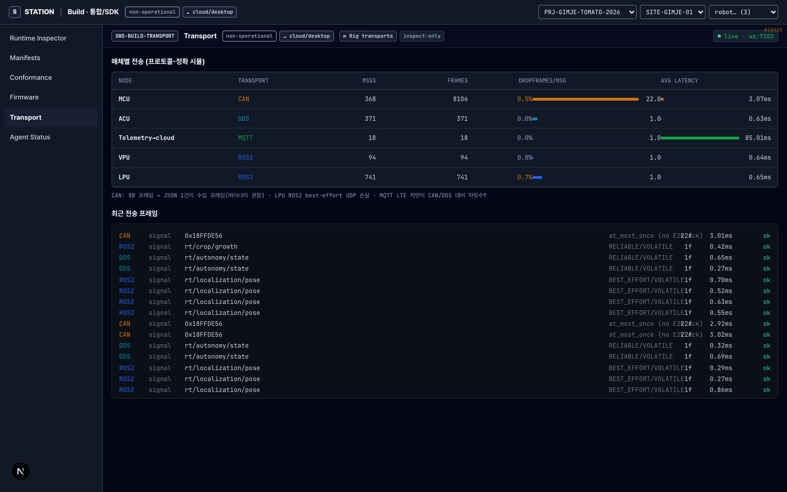

# STATION SDV Rig — 실행 가능 개발 레퍼런스

> 온실 SDV 리그(MCU·VPU·LPU·ACU·Telemetry)를 **각 노드가 제 실 전송(CAN·ROS2·DDS·MQTT)으로**
> Local Agent 에 합류해 growth-scan 폐루프까지 도는 **실행 가능한 참조 구현**. 전송은 *프로토콜-정확
> 시뮬*(단편화·QoS·지연·손실 충실 재현)이며, 실 드라이버(socketcan·rclcpp·mosquitto)가 동일
> 계약으로 교체된다. 개발자는 이걸 띄워 시스템을 이해하고, 자기 노드를 만들 때 그대로 참조한다.
>
> 하드웨어 정의: [sdv-crop-growth-rig.md](../architecture/sdv-crop-growth-rig.md) ·
> 빌드/배선: [sdv-rig-build-guide.md](../architecture/sdv-rig-build-guide.md)

## 빠른 시작

```bash
pnpm install
pnpm --filter @station/local-agent start:rig    # 전 노드 + 에이전트 + growth-scan + 허브
pnpm --filter @station/build dev                # Build 앱(7333) → http://localhost:7333/transport
```

`start:rig` 콘솔은 1Hz 로 **매체별 전송 롤업 표**를 출력하고, `/transport` 페이지는 ws:7102 의
TraceHub 에 접속해 같은 데이터를 라이브로 그린다.



## 무엇이 도는가 (데이터 경로)

```
nodes/{mcu,vpu,lpu,acu}            ← MockSource (실 펌웨어/ROS2 자리)
   │  NodeHost
   ▼
ProfiledTransport(ProtocolProfile) ← CAN·ROS2·DDS·MQTT 매체 거동 모델 + TransportTrace
   │  (loopback | ws://7100 원격)
   ▼
Local Agent  ── SignalStore · CommandRouter(3단 ACK) · SafetyGate · EventBus
   │  AppRuntime: station.app.growth-scan (pose⊕crop⊕state → OBS)
   ├─▶ HmiHub  ws://7101   → Ops/Build 웹 콘솔(관측·명령)
   └─▶ TraceHub ws://7102  → Build /transport(전송 시각화)
```

## 노드별 전송 계약 (관측 가능 거동)

정의: [`packages/local-agent/src/rig/profiles.ts`](../../packages/local-agent/src/rig/profiles.ts) ·
모델: [`packages/node-kit/src/profiles/`](../../packages/node-kit/src/profiles/)

| 노드 | 실 HW | 전송 | QoS | 모델이 재현하는 것 | 레퍼런스 교훈 |
|---|---|---|---|---|---|
| **MCU** | STM32/Portenta · 베어메탈 | **CAN** 2.0B 500kbps | at_most_once | 8B 프레임 · ISO-TP 멀티프레임 · arbitration id · 종단 ACK 없음 | JSON 1건이 **~22 프레임** → 실 MCU 는 바이너리 |
| **VPU** | Jetson Orin · Linux | **ROS2** RTPS/UDP | at_least_once(RELIABLE) | rt/ 토픽 · ACKNACK 재전송 · 무손실 | 분석 결과/이벤트는 RELIABLE |
| **LPU** | SBC · Linux | **ROS2** RTPS/UDP | at_most_once(BEST_EFFORT) | 고주기 pose 스트림 · **UDP 손실 허용** | best-effort 라 ~1% 드랍 발생 |
| **ACU** | Jetson(공유) · Linux | **DDS** | at_least_once(RELIABLE) | 미션 FSM · TRANSIENT_LOCAL | 명령·상태는 신뢰 전송 |
| **Telemetry** | LTE/5G 모뎀 · Linux | **MQTT** QoS1 | at_least_once | 브로커 · 토픽 계층 · **LTE 35~140ms RTT** | 클라우드는 멀다(자릿수↑) |

> 실 DDS 는 토픽별 QoS 를 따로 둔다. 본 모델은 ProtocolProfile.ack(노드=대표 QoS 1개)로 단순화.

## 전송 모니터 읽는 법 (`/transport`)

- **FRAMES/MSG** — CAN 만 1보다 한참 큼(8B 프레임 단편화). ROS2/DDS/MQTT 는 보통 1.
- **AVG LATENCY** — CAN/DDS/ROS2 는 **서브-ms**, MQTT 는 **수십 ms**(LTE). 자릿수 차이가 핵심.
- **DROP** — LPU(BEST_EFFORT)·CAN(버스 에러)·MQTT QoS0 만 0보다 큼. RELIABLE 매체는 0.
- **최근 프레임** — 토픽/arbitration id·QoS·프레임수·지연·전달여부를 메시지 단위로.

## 실 드라이버로 교체 (the seam)

전송은 두 지점에서 교체된다 — **계약(WireMsg·Signal·Command·ACK)은 불변**:

1. **노드 SW 교체** — `nodes/{mcu,vpu,…}/src` 의 `MockSource` 를 실 구현으로.
   MCU=STM32 C/Zig 펌웨어, VPU/ACU/LPU=Jetson ROS2 노드. ([S4 스켈레톤](../../firmware/) 참조)
2. **전송 드라이버 교체** — `ProfiledTransport`(시뮬)를 실 `NodeTransport` 로:
   - CAN → socketcan 위 `NodeTransport`(예 `CanNodeTransport`)
   - ROS2/DDS → rclcpp/rclpy 브리지
   - MQTT → mosquitto 클라이언트
   실 노드는 **ws://localhost:7100(WsHub)** 로 합류하거나(브리지), 보드에서 직접 매체로 붙는다.

`ProtocolModel` 인터페이스(`encode·latencyMs·lossProb·maxRetries`)를 실 측정/드라이버로
구현하면 시뮬과 실물이 같은 관측면(TransportTrace)을 공유한다.

## 물리 리그 배선

전원·E-stop(물리 NC 릴레이)·CAN/Ethernet 배선·BOM 은
[sdv-rig-build-guide.md](../architecture/sdv-rig-build-guide.md). **E-stop 은 SW 가 아니라
하드와이어 회로**로 모터 전원을 끊는다(권한 ① 물리 최상위).

## 파일 맵

| 영역 | 경로 |
|---|---|
| 전송 모델(코어) | [`packages/node-kit/src/profiles/`](../../packages/node-kit/src/profiles/) — model·can·ros2·mqtt·serial-ws·profiled-transport |
| 노드 프로파일 | [`packages/local-agent/src/rig/profiles.ts`](../../packages/local-agent/src/rig/profiles.ts) |
| 전송 모니터/허브 | [`packages/local-agent/src/rig/transport-monitor.ts`](../../packages/local-agent/src/rig/transport-monitor.ts) · [`trace-hub.ts`](../../packages/local-agent/src/rig/trace-hub.ts) |
| 리그 런너 | [`packages/local-agent/run-rig.ts`](../../packages/local-agent/run-rig.ts) |
| 노드 시뮬 | [`nodes/{mcu,vpu,lpu,acu}/src`](../../nodes/) |
| 웹 시각화 | [`apps/build/app/transport/page.tsx`](../../apps/build/app/transport/page.tsx) |
| 테스트 | [`packages/local-agent/test/transport.profiles.test.ts`](../../packages/local-agent/test/transport.profiles.test.ts) |

## 포트

| 포트 | 용도 | env |
|---|---|---|
| 7100 | WsHub — 원격 실노드 합류 | `NODE_WS_PORT` |
| 7101 | HmiHub — 웹 콘솔 관측/명령 | `HMI_WS_PORT` |
| 7102 | TraceHub — 전송 시각화 | `TRACE_WS_PORT` |
