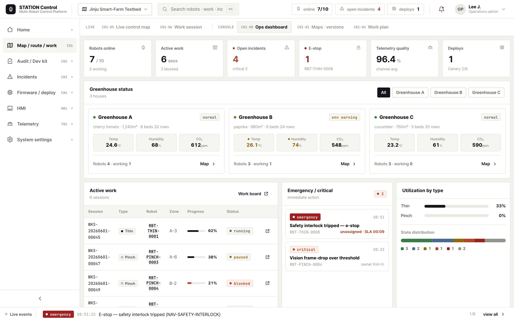
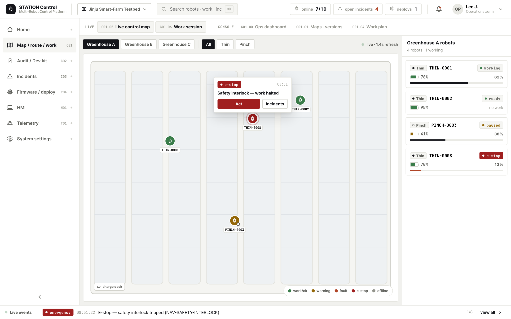
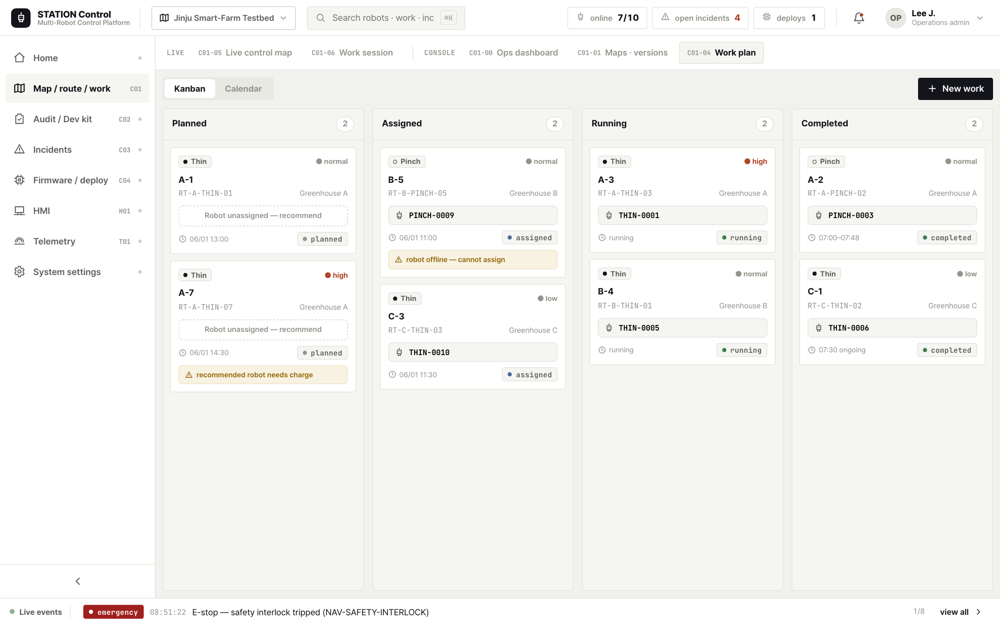
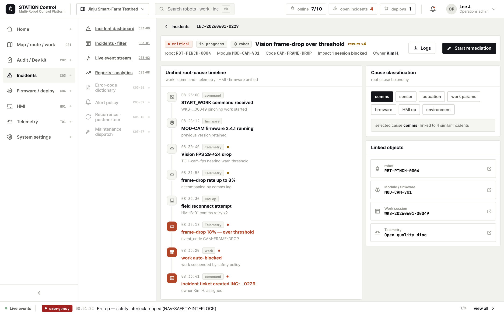
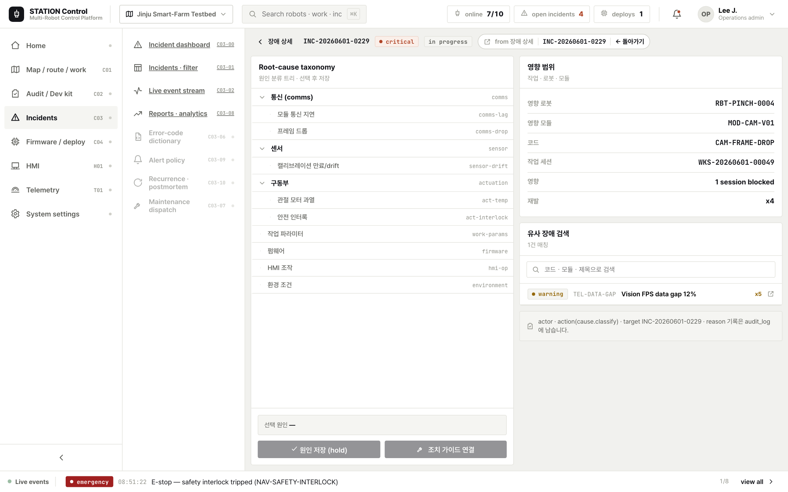
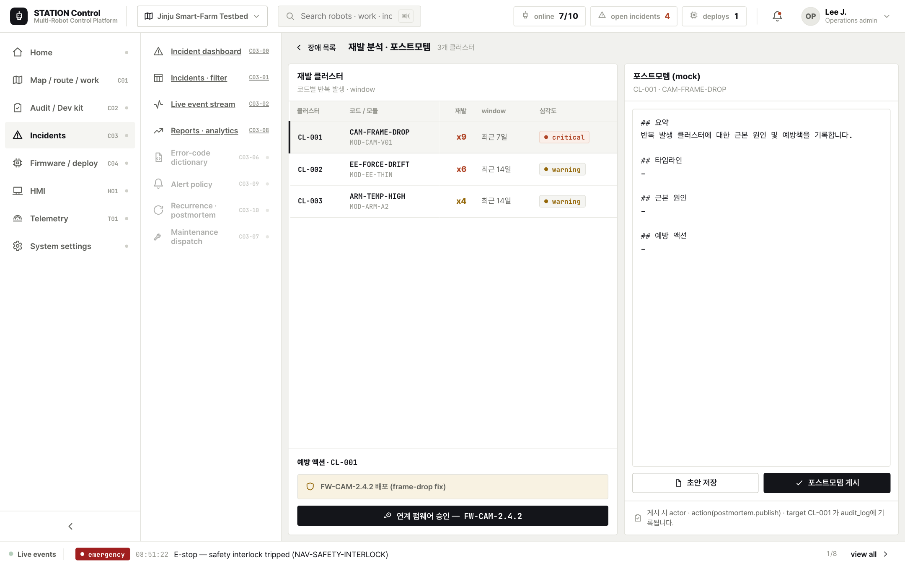
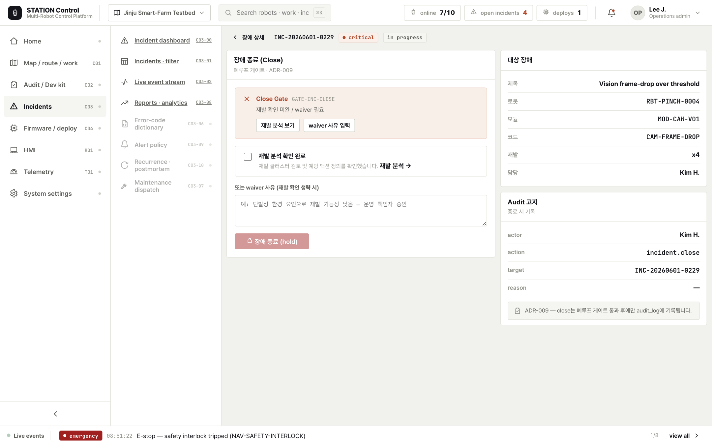

# 04. STATION Ops 제품 UX/UI 수행 완료 보고서

| 문서 코드 | JJ-RPT-04 |
| --- | --- |
| 문서 유형 | 제품별 UX/UI 수행 완료 보고서 (Delivery Report) |
| 대상 제품 | **Ops (관제)** = C01 맵·경로·작업·실시간 + C03 장애·오류·품질 |
| 수행일 | 2026-06-02 |
| 단일 참조 (SSOT) | [00 공통 설계 기준서](../00-ux-common-standards.md) · [01 Ops 과업지시서](../tasks/01-ops-uxui-과업지시서.md) · [화면 갭](../spec-gap.md) |
| 상태 | 수행 완료 — Ops UX/UI 확정, 본 개발 착수 가능 (미결정은 [ADR](../adr/)로 분리) |

> 본 보고서는 [01 Ops 과업지시서](../tasks/01-ops-uxui-과업지시서.md)에 따라 수행한 결과를 보고한다.
> 상태값·Gate 4단계·Audit/Event 분리·권한·DNA·색상 토큰 등 공통 원칙은 [00 공통 기준서](../00-ux-common-standards.md)를 단일 진실 공급원으로 따른다(재정의하지 않고 링크·요약).

---

## 1. 수행 개요

| 항목 | 내용 |
| --- | --- |
| 과업명 | **STATION Ops 관제 운영 시스템 UX/UI 설계** |
| 수행 기간 | 2026-06-01 ~ 2026-06-02 (목업 라운드) |
| 목적 | 끊겨 있던 **작업 폐루프(Loop1)·장애 폐루프(Loop2)** 를 화면 단위로 닫고, 00 기준서의 상태·Gate·Audit·권한·Context 표현을 Ops 전 화면에 일관 적용하는 UX/UI 설계 기준을 확정 |
| 대상 제품 | **Ops (관제)** = C01 통합 관제 + C03 장애·오류·품질 |
| 주 사용자 | 운영관리자 · 관제 오퍼레이터 (보조: 유지보수 · 현장 관리자) |
| 디바이스 | Desktop 1440×900 |
| 디자인 방향 | enterprise 고밀도 · 맵 중심 · 상태 우선 · **live(실시간)/console(관리·설정) 이중 모드** |

본 과업은 STATION 3제품(Ops·Build·Field) 중 **관제 제품**을 대상으로 한다. 다수의 적과·적심 로봇을
실시간 모니터링하고 작업을 배정·추적하며 장애를 조치·종료하는 운영의 중심 허브로서, 본 라운드에서는
[갭 분석](../spec-gap.md) 기준 미구현으로 끊겨 있던 장애 폐루프의 3개 화면(원인 분류·재발 분석·Close)을
신규 구현해 **Loop1·Loop2를 닫는 것**을 핵심 완료 기준으로 삼았다([01 §8 Ops 완료 기준](../tasks/01-ops-uxui-과업지시서.md#8-검수-기준)).

---

## 2. 수행 범위

### 2.1 설계/구현 화면

[01 §5.1 화면 목록](../tasks/01-ops-uxui-과업지시서.md#51-화면-목록-c01-0009--c03-0010-전체--구현미구현--ops-매핑) 및
[spec-gap.md](../spec-gap.md) 기준. ✅이식(기존) · 🆕신규 구현(본 라운드) · ⏸Phase 2.

| 워크스페이스 | 화면 ID | 화면명 | 상태 | OPS 목업 |
| --- | --- | --- | --- | --- |
| C01 | C01-00 | 통합 운영 대시보드 | ✅ | OPS-01 |
| C01 | C01-01 | 온실 맵 목록·버전 | ✅ | OPS-01 연계 |
| C01 | C01-04 | 작업 계획 보드 | ✅ | OPS-04 |
| C01 | C01-05 | 멀티로봇 실시간 관제 맵 | ✅ | OPS-02 |
| C01 | C01-06 | 작업 세션 라이브 상세 | ✅ | OPS-05 |
| C01 | C01-07 | 로봇 상세 드로어 | ✅ (shell) | OPS-03 |
| C01 | C01-02/03/08/09 | 맵·경로 디자이너 / 이력 / 가져오기 | ⏸ Phase 2 | — |
| C03 | C03-00 | 장애 운영 대시보드 | ✅ | OPS-06 연계 |
| C03 | C03-01 | 장애 목록·필터 | ✅ | — |
| C03 | C03-02 | 실시간 이벤트 스트림 | ✅ | OPS-06 |
| C03 | C03-03 | 장애 상세·원인 타임라인 | ✅ | OPS-07 |
| C03 | **C03-04** | **원인 분류·영향 범위** | **🆕 신규** | OPS-07 |
| C03 | C03-05 | 조치 가이드·체크리스트 | ✅ | OPS-07 |
| C03 | C03-08 | 장애 리포트·분석 | ✅ | — |
| C03 | **C03-10** | **재발 분석·포스트모템** | **🆕 신규** | OPS-08 |
| C03 | **(신규)** | **장애 Close** (C03-03 close · [ADR-009](../adr/ADR-009-incident-closed-state.md)) | **🆕 신규** | OPS-08 |
| C03 | C03-06/07/09 | 코드 사전 / SLA 출동 / 알림 정책 | ⏸ Phase 2 | — |

### 2.2 사용자 · 디바이스

- **주 사용자**: 운영관리자 · 관제 오퍼레이터. 보조로 유지보수(remediation·close 요청)·현장 관리자(assign/param). 6역할 V(조회)/E(실행)/A(승인)을 [00 §8](../00-ux-common-standards.md#8-권한-표현-원칙)·[01 §2.1](../tasks/01-ops-uxui-과업지시서.md#21-대상-사용자) 매트릭스로 화면 맥락에 반영.
- **디바이스**: Desktop 1440×900 (전 화면). density-compact 그리드, hairline 보더, mono tabular 숫자.

### 2.3 적용 디자인 시스템

- **3-tier 토큰**: `primitive → semantic → [data-theme="ops"]`. 컴포넌트는 semantic 토큰·유틸클래스만 소비하므로 테마는 레이어로 동작한다([00 §4.2](../00-ux-common-standards.md#42-3-tier-디자인-토큰)).
- **`data-theme="ops"` 고밀도**: Ops override는 밀도·강조·타이포·radius·모션에 한정하고 패밀리 DNA는 변경하지 않는다.
- **공통 DNA(불변)**: 상태 배지(squared dot+mono), mono tabular 숫자, live dot `#1fb46a`, ink 단일 브랜드, 페이퍼화이트+hairline, 로봇 정체성(Thin=채운 점·Pinch=빈 점)([00 §4.1](../00-ux-common-standards.md#41-패밀리-dna--불변--제품-테마가-절대-변경-금지)).

---

## 3. 주요 설계 결과

### 3.1 정보 구조 — 안전 > 작업 > 로봇/모듈 > 이력

Ops 모든 화면은 정보 우선순위 **1 안전/장애 > 2 작업 상태 > 3 로봇/모듈 > 4 이력/설정**을 시각 위계로
구현한다([00 §9.1](../00-ux-common-standards.md#91-ops--고밀도-관제), [01 §3.2](../tasks/01-ops-uxui-과업지시서.md#32-정보-구조-원칙-00-91)). critical/emergency는 절대 접히지 않으며, 공통 셸(상단 바 · 좌측 글로벌 내비 · 중앙 작업 영역 · 우측 컨텍스트 드로어 · 하단 이벤트 스트립)을 전 화면 고정 유지한다.

### 3.2 핵심 사용자 흐름 — 폐루프 L1(작업) · L2(장애)

[00 §10](../00-ux-common-standards.md#10-핵심-폐루프-5종-제품-경계-횡단--우선순위-기준)·[01 §4.1](../tasks/01-ops-uxui-과업지시서.md#41-핵심-시나리오) 기준. Ops 완료 기준 = 두 루프가 화면 단위로 닫힘.

**Loop1 — 작업 폐루프** (공유 스파인 `work_session_id`, 게이트 G1·G3·G4·G7)

```
[C01-04 작업 계획 보드]──배정 확정(G1/G3/G4/G7·hold·Audit)──→(Field H01 handoff)
   ──시작──→[C01-05 실시간 맵 / C01-06 세션 라이브]──완료/실패 반영──→ 이력
```

**Loop2 — 장애 폐루프** (공유 스파인 `work_session_id`+`incident_id`, 게이트 G7)

```
[C03-02 이벤트 스트림]──승격(incident_id 생성)──→[C03-00 대시보드]
   ──→[C03-03 상세·타임라인]──원인──→[C03-04 원인 분류 🆕]──조치──→[C03-05]──(Field handoff)
   ──→[C03-10 재발 분석 🆕]──Close(재발 확인 또는 waiver Gate)──→[Close 🆕 → status=closed]
```

본 라운드 신규 3화면(C03-04 원인 분류, C03-10 재발 분석, 장애 Close)이 추가되어 Loop2의 마지막
구간(원인 → 재발 → Close)이 처음으로 화면 단위로 연결되었다.

### 3.3 화면별 설계 방향 (신규 3화면 중심)

| 화면 | 설계 방향 |
| --- | --- |
| C03-04 원인 분류·영향 범위 | 좌 root-cause taxonomy 재귀 트리(선택→`HoldButton` 저장) · 우 영향 범위(`KVStack`)·유사 장애 검색·조치 가이드 연결. 출처 칩(`ContextChip`)으로 장애 상세 복귀 경로 유지 |
| C03-10 재발 분석·포스트모템 | 좌 재발 클러스터 테이블(코드/모듈·재발 수·window·심각도)·예방 액션·연계 펌웨어 승인 진입 · 우 포스트모템 에디터(mock). 게시 시 audit_log 고지 |
| 장애 Close | `GateNotice`로 Close 게이트 4단계 표현. 재발 확인 또는 waiver 미충족=`blocked`(사유+해결행동), 충족=`confirm_required`→`HoldButton` 종료 → `status=closed`([ADR-009](../adr/ADR-009-incident-closed-state.md)) |

### 3.4 상태/권한/Gate/Audit 반영

- **상태 체계**([00 §3](../00-ux-common-standards.md#3-공통-상태-체계)): 로봇·작업·이벤트 심각도·Incident(`open·ack·in_progress·monitoring·resolved·closed`) 상태군을 재정의 없이 표시. 6단계 심각도 = squared dot+mono 배지.
- **권한**([00 §8](../00-ux-common-standards.md#8-권한-표현-원칙)): 6역할 V/E/A. 권한 없는 액션은 숨김이 아니라 비활성+사유 툴팁. e-stop 해제·Close 최종 승인은 하드 거부(요청과 승인 분리).
- **Gate 4단계**([00 §5](../00-ux-common-standards.md#5-gate-표현-원칙-4단계), [ADR-006](../adr/ADR-006-gate-severity-model.md)): `pass | warn | confirm_required | blocked`. `blocked`/`confirm_required`는 반드시 **(a)사유 + (b)해결 행동** 동반. Close 화면이 대표 적용 사례.
- **Audit / Event 분리**([00 §6](../00-ux-common-standards.md#6-audit--event-분리-원칙-adr-007), [ADR-007](../adr/ADR-007-audit-vs-event-log.md)): Event Log(스트림·스트립)와 Audit Log(승인·위험 액션 고지)를 화면에서 분리. 원인 저장·포스트모템 게시·incident close는 `actor·action·target·reason` audit_log 고지를 화면에 노출.

---

## 4. 화면 목업 결과 (스크린샷)

> 임베드 8종. C01 통합 관제 3종 + C03 장애 5종(신규 3종 포함).

### 4.1 C01 통합 관제

#### 통합 관제 대시보드 (C01-00 · OPS-01)



| 구분 | 내용 |
| --- | --- |
| 화면 설명 | 한눈에 안전/작업/로봇 상태를 판단하는 관제 진입 대시보드 |
| 주요 기능 | KPI 카드, 온실별 상태 카드, 진행 중 작업 테이블, critical 이벤트 리스트, 로봇유형별 가동률, 드로어/장애/세션/맵 진입 |
| 개발 참고 | 정보 위계 1~4(안전>작업>로봇>이력) 시각화, 공통 셸 고정 |

#### 멀티로봇 실시간 관제 맵 (C01-05 · OPS-02)



| 구분 | 내용 |
| --- | --- |
| 화면 설명 | 다수 로봇의 실시간 위치·경로 진행을 맵 위에서 비교 |
| 주요 기능 | 로봇 핀(Thin=채운 점/Pinch=빈 점), 경로 진행률, 구역 잠금 레이어, 이벤트 팝오버, 로봇 리스트 사이드바, 일시정지 요청, 장애 화면 이동 |
| 개발 참고 | live dot `#1fb46a`로 스트리밍/정상 표현, 위치 지연·통신 끊김은 색상 외 아이콘+라벨로 구분 |

#### 작업 계획 보드 (C01-04 · OPS-04)



| 구분 | 내용 |
| --- | --- |
| 화면 설명 | 작업 생성·로봇 배정·경로 검증의 Loop1 진입점 |
| 주요 기능 | 작업 생성, 가용 로봇 추천, 경로 선택, **배정 게이트 평가(G1/G3/G4/G7)**, HMI 전송(Field handoff) |
| 개발 참고 | 부적합 로봇·미검증 경로 = 배정 불가 칩(blocked)+사유+해결 행동, 배정 확정=hold+Audit 고지 |

### 4.2 C03 장애·오류·품질

#### 장애 운영 대시보드 (C03-00 · OPS-06 연계)


| 구분 | 내용 |
| --- | --- |
| 화면 설명 | 심각도·조치 대기·작업 영향을 종합한 장애 운영 허브 |
| 주요 기능 | 심각도 KPI, 조치 대기 목록, 작업 영향 카드, 반복 장애 순위, 모듈별 heatmap, 담당자 배정 |
| 개발 참고 | critical/emergency 비접힘, Incident 상태 enum 배지 |

#### 장애 상세·원인 타임라인 (C03-03 · OPS-07)



| 구분 | 내용 |
| --- | --- |
| 화면 설명 | 단일 장애의 원인 후보·통합 타임라인·관련 객체를 모은 상세 |
| 주요 기능 | 장애 요약 헤더, 원인 후보, 통합 타임라인(작업·명령·Telemetry·HMI·펌웨어), 관련 객체 카드, raw log, 조치 시작, **Close 진입** |
| 개발 참고 | Event Log(타임라인) ↔ Audit Log(승인·위험 액션) 분리, 원인 분류·Close 화면으로 분기 |

#### 원인 분류·영향 범위 (C03-04 · 🆕 신규)



| 구분 | 내용 |
| --- | --- |
| 화면 설명 | root-cause taxonomy 트리로 근본 원인을 분류하고 영향 범위·유사 장애를 확인 |
| 주요 기능 | 좌 재귀 taxonomy 트리(선택→hold 저장), 우 영향 범위(`KVStack`)·유사 장애 검색·조치 가이드 연결, 출처 칩 복귀 |
| 개발 참고 | `rootCauseTaxonomy`(domain mock) 소비, 원인 저장 시 `cause.classify` audit_log 고지 |

#### 재발 분석·포스트모템 (C03-10 · 🆕 신규)



| 구분 | 내용 |
| --- | --- |
| 화면 설명 | 코드별 재발 클러스터를 분석하고 포스트모템·예방 액션을 정의 |
| 주요 기능 | 좌 재발 클러스터 테이블(재발 수·window·심각도)·예방 액션·연계 펌웨어 승인 진입(Build handoff), 우 포스트모템 에디터 |
| 개발 참고 | `incidentClusters`(domain mock) 소비, 게시 시 `postmortem.publish` audit_log 고지 |

#### 장애 Close (🆕 신규 · 재발/waiver Gate → `closed`)



| 구분 | 내용 |
| --- | --- |
| 화면 설명 | 폐루프 게이트(재발 확인 또는 waiver)를 통과해야 장애를 종료하는 Close 화면 |
| 주요 기능 | `GateNotice` 4단계(미충족=blocked+사유/해결행동, 충족=confirm_required), 재발 확인 체크/waiver 사유, `HoldButton` 종료→`status=closed`, Audit 고지 |
| 개발 참고 | [ADR-009](../adr/ADR-009-incident-closed-state.md) — close는 폐루프 게이트 통과 후에만 `incident.close` audit_log 기록 |

---

## 5. 본 개발 인계

### 5.1 라우트

| 라우트 | 화면 | 비고 |
| --- | --- | --- |
| `/incident/[id]/cause` | 원인 분류·영향 범위 (C03-04) | 신규 · `apps/console/app/incident/[id]/cause/page.tsx` |
| `/incident/recurrence` | 재발 분석·포스트모템 (C03-10) | 신규 · `apps/console/app/incident/recurrence/page.tsx` |
| `/incident/[id]/close` | 장애 Close (ADR-009) | 신규 · `apps/console/app/incident/[id]/close/page.tsx` |
| `/incident/[id]` · `/incident/stream` · `/incident/list` · `/incident/reports` · `/incident/[id]/action` | 기존 장애 화면 | 이식 |

### 5.2 컴포넌트

신규 화면 구현체는 `apps/console/app/incident/_screens/*`에 위치한다.

| 컴포넌트 | 파일 |
| --- | --- |
| `CauseClassify` | `_screens/CauseClassify.tsx` |
| `Recurrence` | `_screens/Recurrence.tsx` |
| `IncidentClose` | `_screens/IncidentClose.tsx` |

route page는 `incidentId`만 받아 위 컴포넌트에 위임하는 thin wrapper다.

### 5.3 필요 API / 데이터

현재 `@station/domain`의 mock 셀렉터·데이터를 소비한다. **추후 platform-core 실데이터로 교체** 대상.

| 심볼 | 출처 | 용도 |
| --- | --- | --- |
| `getIncident(id)` | `packages/domain/src/selectors.ts` | 장애 단건 조회 |
| `rootCauseTaxonomy` | `packages/domain/src/data/mockups.ts` | 원인 분류 트리(`CauseNode`) |
| `incidentClusters` | `packages/domain/src/data/mockups.ts` | 재발 클러스터(`IncidentClusterMock`) |
| `INCIDENT` (mock) | `packages/domain/src/data/incident.ts` | 장애 목록·sevMeta·statusMeta |

### 5.4 상태 / 권한값

- **Incident 상태 enum** + `closed`([ADR-009](../adr/ADR-009-incident-closed-state.md)): `open · ack · in_progress · monitoring · resolved · closed`.
- **6역할 V/E/A**([00 §8](../00-ux-common-standards.md#8-권한-표현-원칙)): 권한 없음=비활성+사유 툴팁, e-stop 해제·Close 최종 승인은 하드 거부(요청/승인 분리).

### 5.5 공통 인계

| 항목 | 내용 |
| --- | --- |
| design-system 신규 5종 | `GateNotice` · `HoldButton` · `ContextChip` · `SafetyBanner` · `KVStack` (`packages/design-system/src/ux.tsx`) |
| Context Envelope | `ctx.ts` · [ADR-002](../adr/ADR-002-context-envelope-transport.md) — 운반=ID만, 대상 화면 재조회, 출처 칩+return |
| Gate 4단계 | [ADR-006](../adr/ADR-006-gate-severity-model.md) — `pass/warn/confirm_required/blocked`, blocked/confirm은 사유+해결행동 |
| audit ≠ event | [ADR-007](../adr/ADR-007-audit-vs-event-log.md) — Event Log(센서/상태/실시간) vs Audit Log(승인·위험 액션·운영 반영) |

> 후속 협의(서버 정책 재검증·실시간 프로토콜·색상 토큰 정합 등)는 [ADR](../adr/) 링크 참조.

---

## 6. 검수 결과

### 6.1 화면 커버리지 (spec-gap 기준)

| 워크스페이스 | 구현(이식) | 신규 | 폐루프 |
| --- | --- | --- | --- |
| C01 관제 | 6/10 | — | Loop1 닫힘 |
| C03 장애 | 6/11 | +3 (C03-04 · C03-10 · Close) | Loop2 닫힘 |

→ **핵심 폐루프 L1(작업)·L2(장애) 충족**. Loop2의 원인 → 재발 → Close 구간이 신규 3화면으로
처음 화면 단위로 연결되어 닫혔다([01 §8 Ops 완료 기준](../tasks/01-ops-uxui-과업지시서.md#8-검수-기준)).

### 6.2 미구현/후속 (Phase 2)

C01-02/03 맵·경로 디자이너(대형 캔버스), C01-08 이력, C01-09 가져오기, C03-06/07/09(코드 사전·SLA
출동·알림 정책)는 [spec-gap §4 권장 진행 순서](../spec-gap.md#4-권장-진행-순서-제안)에 따라 Phase 2로 이월. 본 과업은 화면 정의·진입점·Gate 표현만 명세.

### 6.3 실측 검증

| 항목 | 결과 |
| --- | --- |
| typecheck | **6/6 성공** (`pnpm typecheck` — hub·field·design-system·shell·domain·console) |
| build | **3/3 성공** (`pnpm build` — console·field·hub) |
| 라우트 | 신규 3 라우트 포함 전 라우트 컴파일 성공 (`/incident/[id]/cause`·`/incident/recurrence`·`/incident/[id]/close` 정상 빌드 → 전 라우트 200) |

---

## 7. 결론

Ops UX/UI를 확정한다. C01 통합 관제 6화면 + C03 장애 6화면(이식) 위에 신규 3화면(원인 분류·재발 분석·
Close)을 추가하여 **작업 폐루프 L1·장애 폐루프 L2가 모두 화면 단위로 닫혔다**. 상태·Gate 4단계·Audit/Event
분리·권한·Context handoff가 00 기준서대로 적용되었고, typecheck 6/6·build 3/3·전 라우트 200으로 실측
검증되었다. **본 개발 착수 가능** 상태이며, 데이터는 `@station/domain` mock에서 platform-core 실데이터로
교체하는 **단계 5(Phase 0 Thin Contract)** 로 연결한다.

---

### 개정 이력
| 버전 | 일자 | 변경 |
| --- | --- | --- |
| v1.0 | 2026-06-02 | 최초 작성 — Ops 제품 수행 완료 보고. [00 공통 기준서](../00-ux-common-standards.md)·[01 과업지시서](../tasks/01-ops-uxui-과업지시서.md) 정합 |

### 관련 문서
[00 공통 기준서](../00-ux-common-standards.md) · [01 Ops 과업지시서](../tasks/01-ops-uxui-과업지시서.md) · [화면 갭](../spec-gap.md) · [ADR](../adr/)
([ADR-002](../adr/ADR-002-context-envelope-transport.md) · [ADR-006](../adr/ADR-006-gate-severity-model.md) · [ADR-007](../adr/ADR-007-audit-vs-event-log.md) · [ADR-009](../adr/ADR-009-incident-closed-state.md))
