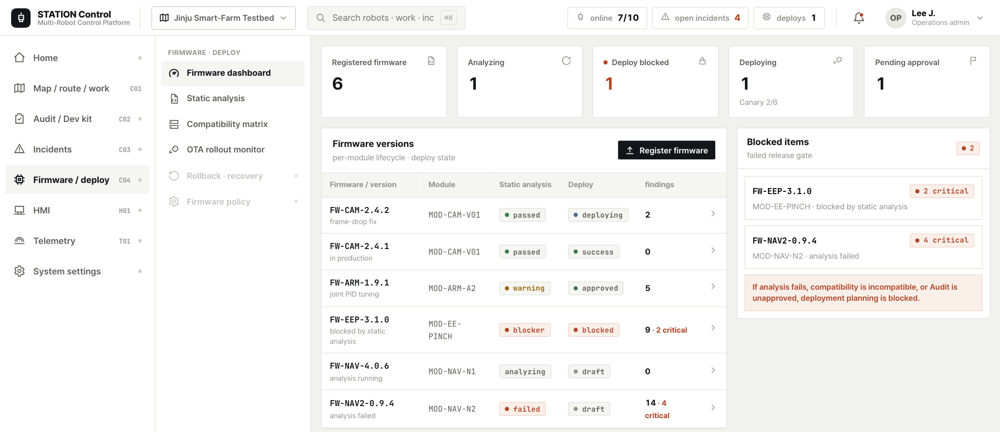
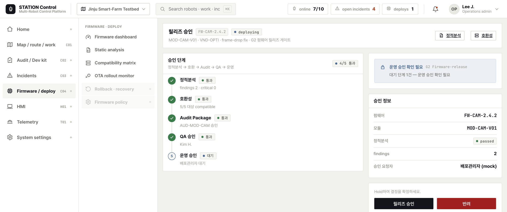
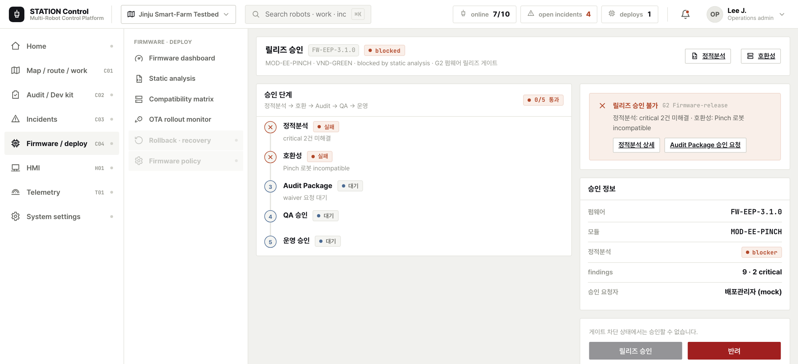
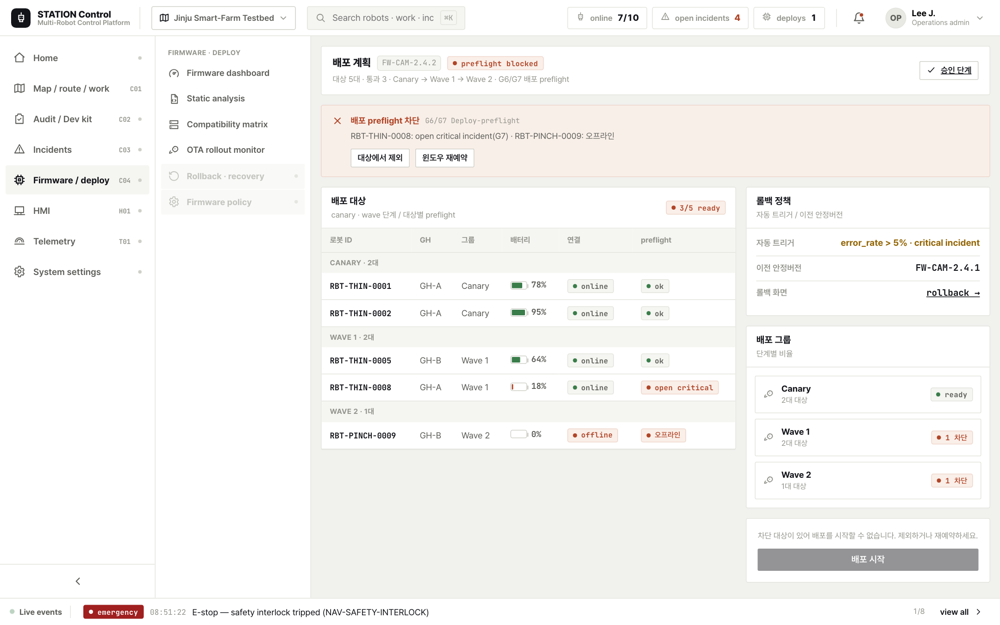
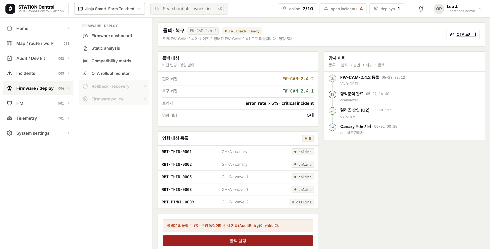
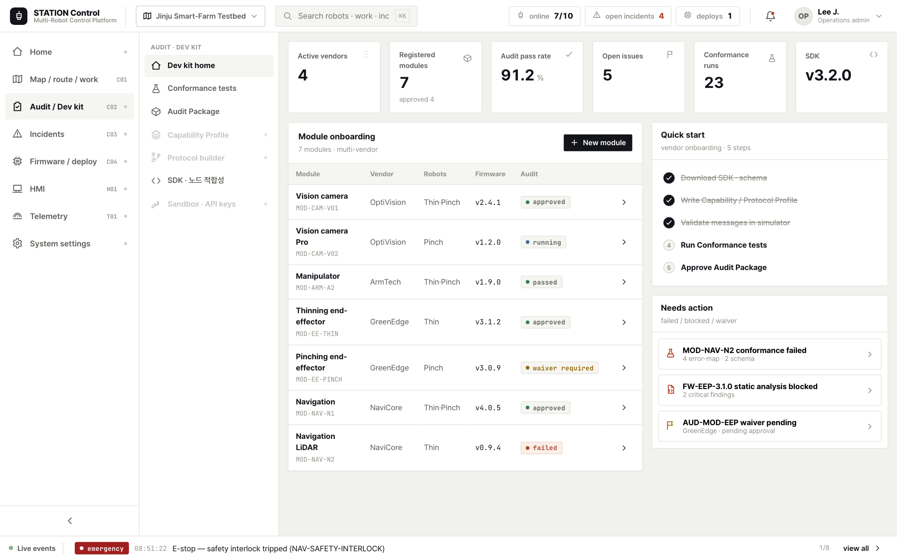
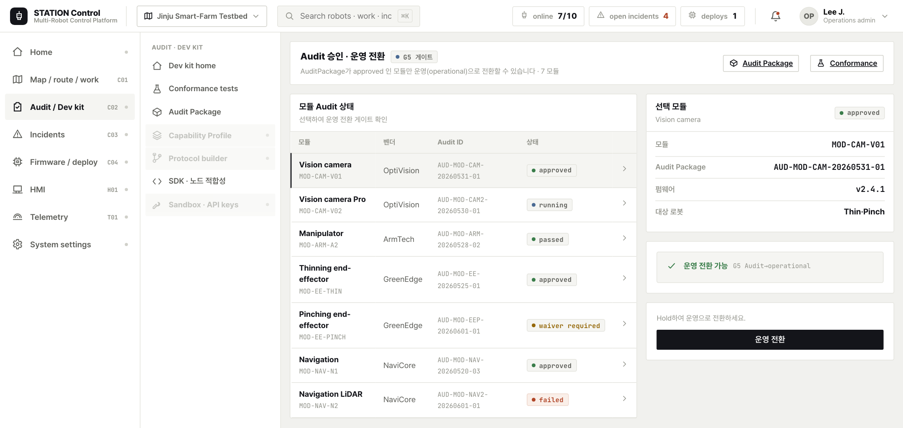
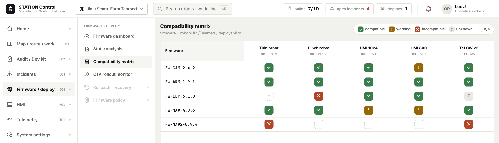
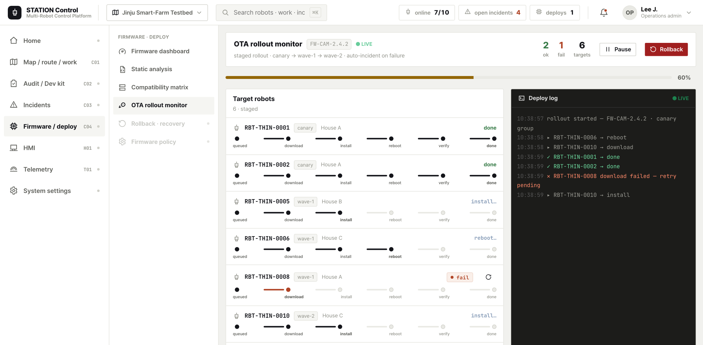

# 05. STATION Build 제품 수행 완료 보고서

| 문서 코드 | JJ-RPT-05 |
| --- | --- |
| 문서 유형 | 제품별 UX/UI 수행 완료 보고서 |
| 대상 제품 | **Build (개발·검증·배포)** = C02 Audit/DevKit + C04 펌웨어/OTA |
| 단일 참조 (SSOT) | [00 공통 설계 기준서](../00-ux-common-standards.md) (특히 §9.2 운영형 콘솔) |
| 근거 과업 | [02 Build 과업지시서](../tasks/02-build-uxui-과업지시서.md) · [화면 갭](../spec-gap.md) |
| 수행일 | 2026-06-02 |
| 상태 | 수행 완료 (미결정·대안은 [ADR](../adr/)로 분리) |

> 본 보고서는 [00 SSOT](../00-ux-common-standards.md)를 단일 참조로 삼는다. 상태·Gate·Audit·권한·DNA가
> 00과 충돌할 경우 **항상 00이 우선**한다. 실제 구현(`apps/console`·`packages/domain`·`packages/design-system`)과
> 일치하는 범위만 기술하며, 미결정은 [ADR](../adr/)로 링크한다.

---

## 1. 수행 개요

### 1.1 과업명
**STATION Build 개발·검증·배포 콘솔 UX/UI 설계**

### 1.2 기간
2026-06-01 ~ 2026-06-02 (목업 라운드 / 단계 3~4)

### 1.3 목적
- 개발자와 배포관리자가 **공통으로 이해 가능한 운영형 배포 콘솔(터미널은 보조)**을 설계한다([00 §9.2](../00-ux-common-standards.md)).
- Audit 승인 → 운영 전환(**Loop5**), Firmware 승인 → 계획 → 진행 → 롤백(**Loop4**)의 **폐루프**를 화면으로 닫는다.
- 모든 Gate(특히 `blocked`)에서 **차단 사유와 해결 행동**을 한 화면에서 명확히 제시한다([00 §5](../00-ux-common-standards.md)).

### 1.4 대상
| 구분 | 내용 |
| --- | --- |
| 대상 제품 | **Build** = C02 Audit/DevKit + C04 펌웨어/OTA |
| 주 사용자 | 제조사 개발자 · 플랫폼 통합 담당자 · 배포 관리자 (+ QA·시스템 관리자) |
| 디바이스 | Desktop 1440×900 |
| 설계 원칙 | **운영형 배포 콘솔(enterprise deployment console)** + 터미널/로그 **보조 레이어** |

> Build의 핵심은 "코드를 짜는 화면"이 아니라 **"배포해도 되는가를 판단하는 화면"**이다. 화면의 1차 언어는
> 의사결정 정보(카드/테이블/타임라인)이며, 터미널 미학은 그 판단의 근거를 보여주는 보조 레이어로 한정한다.

---

## 2. 수행 범위

### 2.1 화면 목록 (이번 라운드 = 폐루프 차단 화면 신규 4종 + 기존 7종)
| 구분 | SSOT ID | 화면 | 컴포넌트 | 상태 |
| --- | --- | --- | --- | --- |
| 신규 | C04-04 | 릴리즈 승인 워크플로우 (G2) | `firmware/_screens/ReleaseApproval.tsx` | ✅ 신규 |
| 신규 | C04-05 | OTA 배포 계획 생성 (G6·G7) | `firmware/_screens/DeploymentPlan.tsx` | ✅ 신규 |
| 신규 | C04-07/08 | 롤백·복구 + 감사 로그 | `firmware/_screens/RollbackRecovery.tsx` | ✅ 신규 |
| 신규 | C02-07 | Audit 승인 → 운영 전환 (G5) | `audit/_screens/AuditApprove.tsx` | ✅ 신규 |
| 기존 | C04-00 | 펌웨어 운영 대시보드 | `firmware/_screens/FirmwareDash.tsx` | ✅ |
| 기존 | C04-02 | 정적분석 결과 상세 | `firmware/_screens/StaticAnalysis.tsx` | ✅ |
| 기존 | C04-03 | 호환성 매트릭스 | `firmware/_screens/CompatMatrix.tsx` | ✅ |
| 기존 | C04-06 | OTA 배포 진행 모니터 | `firmware/_screens/OtaMonitor.tsx` | ✅ |
| 기존 | C02-00 | 개발자 킷 홈 | `audit/_screens/AuditHome.tsx` | ✅ |
| 기존 | C02-06 | Conformance Test Runner | `audit/_screens/ConformanceRunner.tsx` | ✅ |
| 기존 | C02-07 | Audit Package 빌더 | `audit/_screens/AuditBuilder.tsx` | ✅ |

### 2.2 사용자 · 권한 ([00 §8](../00-ux-common-standards.md))
| 역할 | Build 권한 | 화면 맥락 적용 |
| --- | --- | --- |
| 제조사 개발자 | V(자사 한정) · profile/simulate E · **운영반영 승인 불가** | Audit/Release 승인 버튼 **비활성 + 사유 툴팁** |
| 배포 관리자 | V · plan/canary/rollback E · release A(부분) | OTA 계획·canary·롤백 실행 · 릴리즈 부분 승인 |
| 시스템 관리자 | V · E · A all · 위험 정책 | 펌웨어 정책 · waiver 최종 승인 · 전체 장비 배포 |
| QA 담당자 | V · test E | Conformance 실행 · QA 승인 단계 |

> 하드 거부([00 §8](../00-ux-common-standards.md)): **제조사 개발자 ≠ 운영 반영 승인.** 승인/운영 전환 버튼은
> 숨김이 아니라 **비활성 + 사유**로 표현한다.

### 2.3 디바이스
Desktop 1440×900 단일 기준. 고밀도(density-comfortable 기본). 터치영역 규정(44/64px)은 Build 비대상.

### 2.4 적용 디자인 시스템
- 3-tier 토큰 `primitive → semantic → [data-theme="build"]`. Build 테마 override는 **타이트 radius·플랫·밀도**에 한정.
- **DNA 불변**([00 §4.1](../00-ux-common-standards.md)): 6단계 상태 의미 · squared dot+mono 배지 · mono tabular(ID/버전/체크섬/%) ·
  live dot `#1fb46a` · 페이퍼화이트+hairline · audit 정직성(hold + 감사 고지). 색상 토큰 최종값은 [ADR-005](../adr/ADR-005-status-color-tokens.md).

---

## 3. 주요 설계 결과

### 3.1 정보 구조 (1급 = 카드/테이블/타임라인, 보조 = 터미널)
| 정보 유형 | 표현 매체 (1급) | 화면 |
| --- | --- | --- |
| 승인 상태 · 조건 충족 | 단계 타임라인 · 체크리스트 카드 | Release(C04-04) · Audit(C02-07) |
| 호환성 | matrix grid · 배지 | C04-03 |
| **차단 사유 + 해결 행동** | 인라인 `GateNotice` 카드(사유→행동→링크) | 모든 Gate `blocked` |
| 배포 대상 · 그룹 | 대상 테이블 · canary 그룹 카드 | C04-05 |
| 롤백 전략 | 이전 안정버전 카드 · 영향 범위 + AuditEntry | C04-07/08 |

> 보조(터미널 톤 `.term`)는 OTA 이벤트 로그·Conformance 실행 로그·static analysis 출력·시뮬레이터 콘솔에만
> 한정한다. 핵심 의사결정 화면은 **enterprise 콘솔**로 설계하며 터미널화하지 않는다([00 §9.2](../00-ux-common-standards.md)).

### 3.2 핵심 흐름 — 폐루프 L4(펌웨어) · L5(audit)
- **Loop4 (펌웨어, G2·G6/G7)**: 등록 → 분석 → 호환성 → **승인(C04-04, G2)** → **계획(C04-05, G6/G7)** →
  진행(C04-06) → **롤백(C04-07)** → **감사(C04-08)**. 공유 스파인 `firmware_id(FW-…)` → `deployment_plan_id(DEP-…)`.
- **Loop5 (audit, G5)**: Conformance → Audit Package → **승인 → 운영 전환(C02-07, G5)**. 공유 스파인 `module_id` + `audit_package_id`.

### 3.3 Gate 4단계 차단 사유 + 해결 행동 (`packages/domain/src/gates.ts` 실측)
| Gate | 함수 | blocked 사유 (mock) | 해결 행동 |
| --- | --- | --- | --- |
| **G2** Firmware-release | `gateFirmwareRelease` | "정적분석: critical 2건 미해결 · 호환성: Pinch 로봇 incompatible" | 정적분석 상세 · Audit Package 승인 요청 |
| **G5** Audit→operational | `gateAuditOperational` | "AuditPackage 미승인 (현재: …) — 운영 전환 불가" | 실패 테스트 재실행 · 이슈 보드 |
| **G6/G7** Deploy-preflight | `gateDeployPreflight` | "RBT-PINCH-0009: 오프라인 · RBT-THIN-0008: open critical incident(G7)" | 대상에서 제외 · 윈도우 재예약 |

> **핵심 규칙 준수**: `blocked`이면 UI는 반드시 **(a) 차단 사유**와 **(b) 해결 행동(+링크)**을 `GateNotice`로 함께
> 표시하고, 승인/전환 버튼은 **비활성**한다. 위험 액션(롤백)은 `HoldButton` + `ConfirmModal(requireHold)` + AuditEntry 고지.

### 3.4 Audit ≠ Event ([00 §6](../00-ux-common-standards.md), [ADR-007](../adr/ADR-007-audit-vs-event-log.md))
- **Event Log**: 분석 진행·배포 진행·OTA 단계 전이 → 이벤트 스트립·OTA 로그·Runner 로그(`.term`).
- **Audit Log**: 운영 반영·승인 행위·정책 우회·롤백 → C04-08 감사 이력 + AuditEntry(`actor·action·target·reason·before/after`).
  롤백 화면은 커밋 전 `ConfirmModal`의 `auditNote`로 AuditEntry를 고지한다.

### 3.5 화면별 방향
| 화면 | 방향 |
| --- | --- |
| Release 승인 (C04-04) | 좌 1.5fr 단계 타임라인(원형 rail·통과/대기/실패/면제) · 우 `GateNotice` + 승인 정보 + Hold 결정 |
| 배포 계획 (C04-05) | 상단 `GateNotice` · 좌 canary/wave 그룹별 대상 테이블(배터리·연결·preflight) · 우 롤백 정책 + 배포 시작 Hold |
| 롤백 (C04-07/08) | 좌 롤백 대상·영향 목록 + 롤백 실행 Hold · 우 AuditEntry 고지 카드 + 감사 이력 타임라인 |
| Audit 승인 (C02-07) | 좌 모듈 Audit 상태 테이블 · 우 선택 모듈 `GateNotice`(G5) + 운영 전환 Hold |

---

## 4. 화면 목업 결과 (스크린샷)

### 4.1 펌웨어 대시보드 (C04-00)

- **기능**: 버전·분석·배포 가능·위험 KPI 요약, blocked release 패널, 배포 계획 진입.
- **참고**: Loop4 진입점. `firmware/_screens/FirmwareDash.tsx`.

### 4.2 릴리즈 승인 — pass (C04-04, 신규)

- **기능**: `FW-CAM-2.4.2` — 정적분석/호환/Audit/QA 통과, 운영 승인 pending. 단계 타임라인 + 체크리스트.
- **참고**: G2 게이트 `confirm_required`(대기 단계) — 승인 버튼은 Hold로 확정. `gateFirmwareRelease`.

### 4.3 릴리즈 승인 — blocked (신규)

- **기능**: `FW-EEP-3.1.0` — 정적분석 critical 2건 미해결 + 호환 불가 + Audit 미승인.
- **참고**: **G2 `GateNotice`** 가 차단 사유(분석/호환/audit)를 한 줄로, 해결 행동(정적분석 상세·Audit 승인 요청)을
  링크 버튼으로 제시. **승인 버튼 비활성**.

### 4.4 배포 계획 (C04-05, 신규)

- **기능**: canary → wave-1 → wave-2 그룹별 대상 테이블(배터리·연결·preflight), 롤백 정책 카드.
- **참고**: **G6/G7** — `RBT-THIN-0008` open critical(G7) · `RBT-PINCH-0009` 오프라인(G6)으로 preflight blocked,
  배포 시작 Hold 비활성. `gateDeployPreflight`.

### 4.5 롤백·감사 (C04-07/08, 신규)

- **기능**: 현재 → 이전 안정버전(`FW-CAM-2.4.1`) 복구, 영향 대상 목록, 등록→분석→승인→배포→롤백 감사 타임라인.
- **참고**: 롤백 실행 = `HoldButton` → `ConfirmModal(requireHold, danger)` + **AuditEntry** 고지(actor/action/before→after).

### 4.6 Dev kit 홈 (C02-00)

- **기능**: 온보딩 진행률·최근 Audit·실패 테스트·SDK 요약. **참고**: Loop5 진입점. `audit/_screens/AuditHome.tsx`.

### 4.7 Audit 승인 → 운영 전환 (신규)

- **기능**: 모듈 Audit 상태 테이블에서 모듈 선택 → 운영(operational) 전환.
- **참고**: **G5 `GateNotice`** — approved 아닌 모듈은 "운영 전환 불가" 사유 + 재실행/이슈보드 행동, 전환 Hold 비활성.

### 4.8 호환성 매트릭스 (C04-03)

- **기능**: 로봇/모듈/HMI/Telemetry 조합 배포 가능 여부 grid + 차단 사유. **참고**: Loop4 #3. `CompatMatrix.tsx`.

### 4.9 OTA 배포 진행 (C04-06)

- **기능**: 다운로드·설치·재시작·검증 진행 헤더 + 대상별 상태 테이블 + 이벤트 로그(`.term` 보조).
- **참고**: Loop4 #6. success/failed → rollback_required. `OtaMonitor.tsx`.

---

## 5. 본 개발 인계

### 5.1 라우트
| 라우트 | 컴포넌트 | 비고 |
| --- | --- | --- |
| `/firmware/[id]/approve` | `ReleaseApproval` | id = `firmware_id` (예 `FW-CAM-2.4.2`·`FW-EEP-3.1.0`) |
| `/firmware/[id]/deploy-plan` | `DeploymentPlan` | 계획 없으면 EmptyNote |
| `/firmware/[id]/rollback` | `RollbackRecovery` | 배포 정책 없으면 EmptyNote |
| `/audit/approve` | `AuditApprove` | 모듈 선택 기반(파라미터 없음) |

> 페이지는 `params: Promise<{id}>`를 await하여 `firmwareId`를 컴포넌트에 전달(Next.js async params).

### 5.2 컴포넌트
- `apps/console/app/firmware/_screens/{ReleaseApproval,DeploymentPlan,RollbackRecovery}.tsx`
- `apps/console/app/audit/_screens/AuditApprove.tsx`
- 모두 `"use client"`. 결정 상태(`done`/`promoted`/`audit`)는 `useState` 로컬(mock).

### 5.3 API / 데이터 (`@station/domain`)
- 데이터: `releaseApprovals`·`deploymentPlans`(`packages/domain/src/data/mockups.ts`), `RELEASE`(`data/release.ts`: vendors·modules·firmwares·auditMeta·fwMeta).
- 게이트: `gateFirmwareRelease`·`gateDeployPreflight`·`gateAuditOperational`(`gates.ts`) — **클라이언트 표시용 UX 게이트(서버 재검증 아님)**.
- **추후**: RELEASE/mockups는 mock → platform-core 연동으로 교체(실시간 소스 추상화는 [ADR-008](../adr/ADR-008-async-migration.md)).

### 5.4 상태 / 권한 값
- 펌웨어 배포 상태 enum: `draft·analyzing·blocked·approved·scheduled·deploying·success·failed·rollback_required·rolled_back` (생명주기/배포 분리 표시).
- Audit 상태 enum: `draft·submitted·running·passed·failed·waiver_required·approved·expired`. 승인 단계 status: `passed·pending·failed·waived`.
- 6역할 × V/E/A 권한([00 §8](../00-ux-common-standards.md)) — 제조사 개발자 운영반영 승인 **하드 거부**.

### 5.5 공통 인계
- design-system 신규/공유 5종: `GateNotice`(4단계)·`HoldButton`·`ConfirmModal(requireHold·auditNote)`·`KVStack`·`StatusBadge`(`packages/design-system/src/ux.tsx`·`components.tsx`).
- Context Envelope([ADR-002](../adr/ADR-002-context-envelope-transport.md)): 출처 칩 + 돌아가기로 크로스 제품 컨텍스트 운반.
- ID 문법([ADR-004](../adr/ADR-004-id-grammar.md)): `FW-<MODTYPE>-<semver>` · `DEP-YYYYMMDD-NNNN`.

### 5.6 미결정 ADR
[ADR-004](../adr/ADR-004-id-grammar.md) ID 문법 · [ADR-005](../adr/ADR-005-status-color-tokens.md) 상태 색상 토큰 ·
[ADR-006](../adr/ADR-006-gate-severity-model.md) Gate 4단계 · [ADR-007](../adr/ADR-007-audit-vs-event-log.md) Audit/Event ·
[ADR-008](../adr/ADR-008-async-migration.md) async 전환.

---

## 6. 검수 결과

### 6.1 커버리지 — 폐루프 닫힘
| 워크스페이스 | 기존 | 신규 | 폐루프 |
| --- | --- | --- | --- |
| C02 Audit/DevKit | 3/11 | +1 (C02-07 승인 G5) | **Loop5 닫힘** |
| C04 펌웨어/OTA | 4/11 | +3 (C04-04·05·07/08) | **Loop4 닫힘** |

> 분석 실패·호환 불가·Audit 미승인 중 하나라도 있으면 승인/배포 계획이 차단되어, "분석→배포→롤백/감사" 폐루프가 닫힌다.

### 6.2 Gate 표현
- **G2/G5/G6/G7 모든 `blocked`** 가 `GateNotice`로 **(a) 사유 + (b) 해결 행동(+링크)**을 한 화면에 표시 — 실측 확인.
- 위험 액션(롤백·운영 전환·배포 시작)은 `HoldButton`/`ConfirmModal(requireHold)` + 사유. blocked 시 버튼 비활성.

### 6.3 디자인 방향
- 핵심 의사결정 화면(C04-04·05·07 / C02-07)은 **카드/테이블/타임라인 중심**, 터미널 비대화. 의사결정 = 카드/테이블.
- `.term` 터미널은 OTA 이벤트 로그·Conformance 로그·static analysis 등 **보조 영역**에만 사용.

### 6.4 미구현 / 후속 (Phase 2 — [spec-gap §4](../spec-gap.md))
- C02 온보딩(C02-01)·Capability(C02-02)·Protocol(C02-03)·SDK(C02-08)·샌드박스(C02-09)·이슈보드(C02-10)·매퍼/시뮬레이터.
- C04 등록 마법사(C04-01)·모듈 버전 상세(C04-09)·펌웨어 정책(C04-10). mock → platform-core 연동.

### 6.5 실측
| 항목 | 결과 |
| --- | --- |
| typecheck | **6/6 성공** (`turbo run typecheck` — console·field·hub·design-system·domain·shell) |
| build | **3/3** (console·field·hub) |
| 라우트 | approve·deploy-plan·rollback·audit/approve **200** |

---

## 7. 결론

Build UX/UI는 **운영형 배포 콘솔(터미널 보조)** 원칙 아래 폐루프 차단 화면 4종(C04-04·05·07/08·C02-07)을 신규
구현하여 **Loop4(펌웨어)·Loop5(audit) 폐루프를 닫았다.** 모든 Gate `blocked`가 사유 + 해결 행동을 표현하고,
위험 액션은 Hold + AuditEntry 고지로 audit 정직성을 지킨다. typecheck 6/6·build 3/3로 빌드 무결성을 확인했다.
**Build 화면 설계는 확정되었으며 본 개발 착수가 가능하다.** Phase 2(C02 온보딩/SDK 등) 보강과 mock → platform-core
연동을 **단계 5**로 연결한다.

---

### 문서 정보 · 개정 이력
| 버전 | 일자 | 변경 |
| --- | --- | --- |
| v1.0 | 2026-06-02 | 최초 작성 — 단계 4 Build 수행 완료 보고 |

**관련 문서**: [00 공통 기준서](../00-ux-common-standards.md) · [02 Build 과업지시서](../tasks/02-build-uxui-과업지시서.md) ·
[화면 갭](../spec-gap.md) · [ADR](../adr/)
