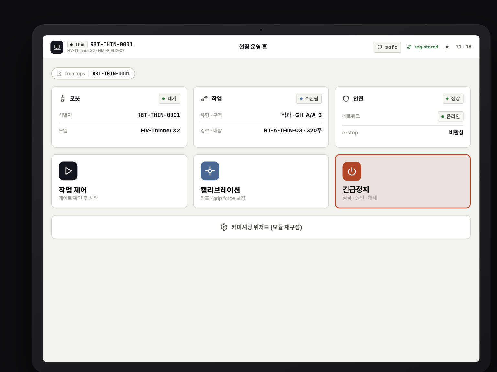
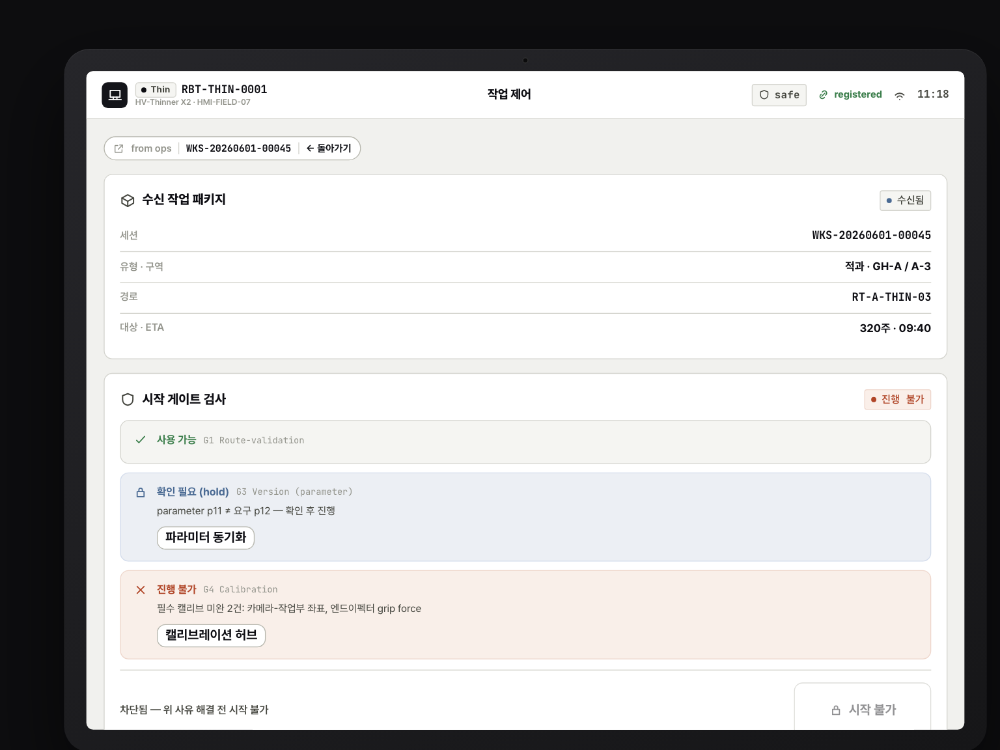
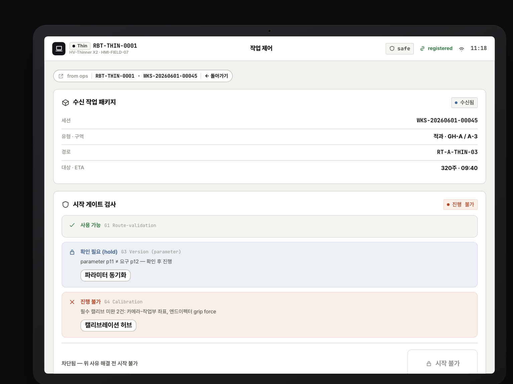
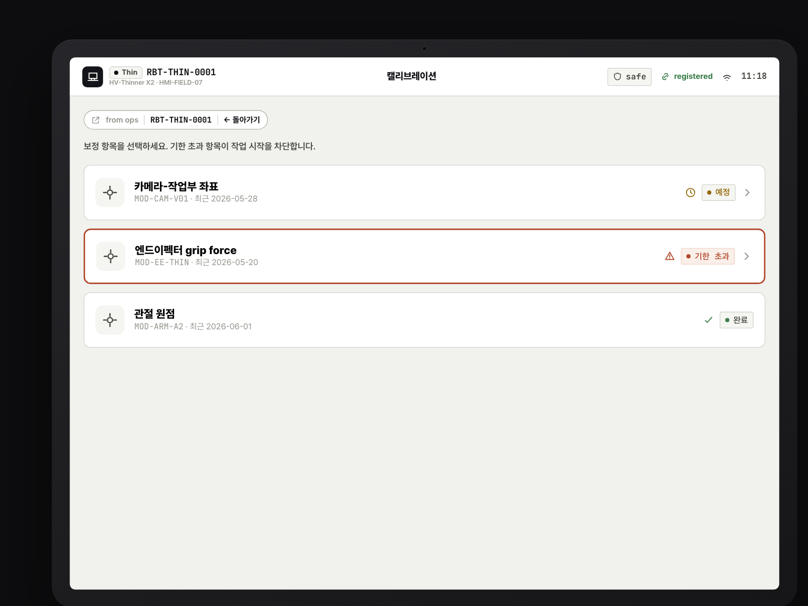
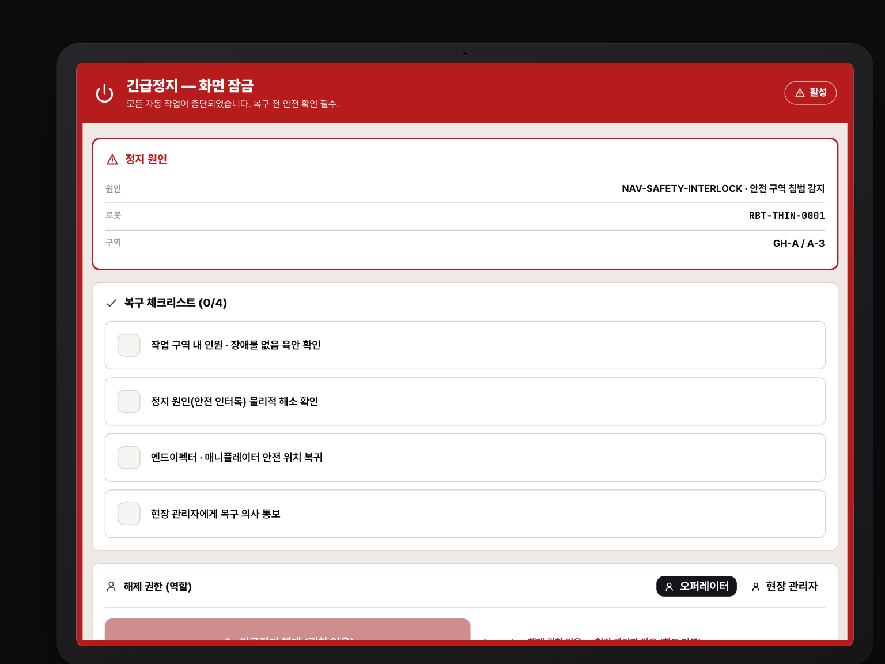
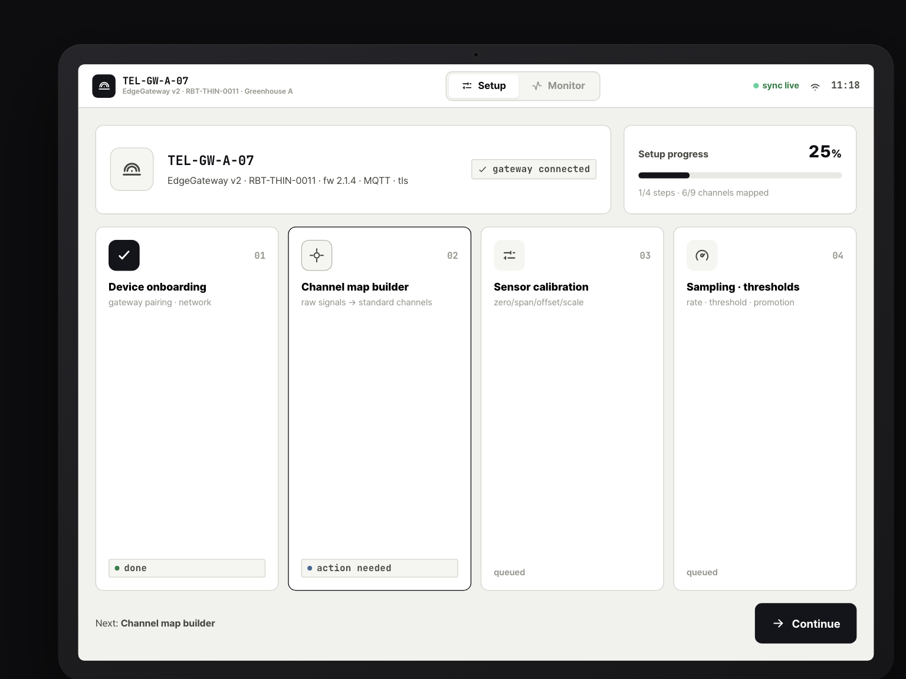

# 06. STATION Field 제품 UX/UI 수행 완료 보고서

| 문서 코드 | JJ-RPT-06 |
| --- | --- |
| 문서 유형 | 제품별 UX/UI 수행 완료 보고서 (Field) |
| 대상 제품 | **Field (현장)** = H01 HMI 현장 운용 + T01 Telemetry 설정/캘리브레이션 |
| 수행일 | 2026-06-02 |
| 안전 등급 | **최상 (3제품 중 가장 엄격 — 물리적 안전이 걸린 현장 제품)** |
| 단일 참조 (SSOT) | [00 공통 설계 기준서](../00-ux-common-standards.md) · [03 Field 과업지시서](../tasks/03-field-uxui-과업지시서.md) · [화면 갭](../spec-gap.md) |

> 본 보고서는 단계 4 **Field 제품 수행 완료**를 보고한다. 코드 변경 없이 실제 구현([apps/field](../../apps/field))을
> 근거로 결과를 정리한다. 모든 원칙·게이트·권한·컨텍스트 표현은 [00 공통 기준서](../00-ux-common-standards.md)를
> 단일 진실 공급원으로 따르며, 미결정 항목은 본문이 아니라 [ADR](../adr/) 링크로 둔다.

---

## 1. 수행 개요

| 항목 | 내용 |
| --- | --- |
| 과업명 | **STATION Field HMI·Telemetry 현장 운영 UX/UI 설계** |
| 기간 | 2026-06-01 ~ 2026-06-02 |
| 목적 | **5초 내 상태 글랜스**(HMI 홈)와 **위험 조작 실수 방지**(작업 시작·캘리브 저장·e-stop)를 양립시키는 현장 UX 확정 |
| 대상 제품 | Field (현장) = H01(HMI 현장 운용·캘리브레이션) + T01(Telemetry 설정·품질) |
| 주 사용자 | 현장 오퍼레이터 · 유지보수 담당 (현장 관리자 일부 승인 권한) |
| 디바이스/해상도 | HMI 1024×600 · HMI 800×480 · Tablet 1024×768 |
| 안전 등급 | **최상** — 물리적 안전이 화면 위에서 직접 일어나므로 3제품 중 가장 엄격한 안전 UX |

Field는 적과/적심 로봇의 현장 HMI 하드웨어와 Telemetry 장치 설정을 다루는 제품으로, 온실 현장의 오퍼레이터·유지보수 담당이
**장갑 낀 손**으로 **저해상도 HMI 패널**과 **태블릿**을 조작한다. 작업 시작·캘리브레이션·긴급정지처럼 물리적 안전이
걸린 조작이 화면 위에서 직접 일어나므로, Field는 3제품 중 **가장 엄격한 안전 UX**를 요구한다. 본 단계는 현 골격에서
사실상 커미셔닝 위저드만 있던([화면 갭](../spec-gap.md) H01 ~17%) Field에 **현장 운영·안전 폐루프**를 화면으로 닫는 것을 목표로 한다.

---

## 2. 수행 범위

### 2.1 화면 목록 (구현 결과)

| 영역 | 화면 | 라우트 | 구현 컴포넌트 | SSOT 매핑 |
| --- | --- | --- | --- | --- |
| HMI 홈 | HMI 홈 허브(신규) | `/hmi` | `_components/HmiHomeHub.tsx` | H01-01 |
| HMI 작업 | 작업 제어(신규) — 수신·Gate·진행·정지/재개 | `/hmi/operate` | `_components/Operate.tsx` | H01-02 (FIELD-02~05) |
| HMI 캘리브 | 캘리브레이션(신규) — 허브·단계·저장 | `/hmi/calibrate` | `_components/Calibrate.tsx` | H01-06/07 (FIELD-07/08) |
| HMI 안전 | 긴급정지(신규) — 잠금·복구·해제 | `/hmi/estop` | `_components/Estop.tsx` | H01-11 (FIELD-11/12) |
| HMI 커미셔닝 | 모듈 커미셔닝 위저드(기존) | `/hmi/commission` | `_components/CommissionHub.tsx` | H01-00 일부 |
| Telemetry | 설정/모니터(T01) | `/telemetry` | `telemetry/_components/*` | T01-01/02/03/06/08 (이식) |

### 2.2 사용자·권한 ([00 §8](../00-ux-common-standards.md#8-권한-표현-원칙))

권한 없는 액션은 **숨김이 아니라 비활성 + 사유 툴팁**, 위험 거부는 동작 차단.

| 역할 | Field V/E/A | 본 단계 화면 반영 |
| --- | --- | --- |
| 현장 오퍼레이터 | V · 작업 제어 E(hold) · **e-stop 해제 불가(하드 거부)** | 작업 제어 hold-to-confirm · 긴급정지에서 해제 버튼 **시각(비활성+사유)·동작(차단) 모두 차단** |
| 현장 관리자 | V · param/calib E · 현장 param A · **e-stop 해제 승인** | 긴급정지 역할 토글 `manager` + 복구 체크리스트 4/4 완료 후에만 hold 해제 |
| 유지보수 | V · calib/I/O E | 캘리브레이션 허브·단계 위저드 |

> **하드 거부 구현**: `Estop.tsx`에서 `role === "operator"`이면 해제 버튼이 `disabled`·`opacity 0.5`·`cursor not-allowed` +
> "e-stop 해제 권한 없음 — 현장 관리자 필요 (하드 거부)" 사유를 표시한다. 해제 hold 버튼은 `role === "manager" && 체크리스트 4/4`일 때만 활성.

### 2.3 디바이스/해상도

| 해상도 | 디바이스 | 레이아웃 전략 |
| --- | --- | --- |
| 1024×768 | Tablet(설치·유지보수) | 베젤 스케일(`HmiFrame`), 2열 가능 |
| 1024×600 | HMI 패널(주 운용) | 단일 판단 1열, 하단 고정 영역 |
| 800×480 | HMI 패널(소형) | 정보 축약·핵심만, **터치 64px는 바닥값으로 불변** |

### 2.4 적용 디자인 시스템 ([00 §4](../00-ux-common-standards.md#4-공통-디자인-언어))

- **Field 테마 토큰** `[data-theme="field"]`(`packages/design-system/src/tokens.css`): `--control-h: 64px`·`--touch-min: 64px`(장갑 손 64px 터치),
  소프트 radius, 고대비. 패밀리 DNA(상태 배지 의미·색, mono tabular, live dot `#1fb46a`, ink 단일 브랜드)는 불변.
- **HmiFrame 베젤**(`_components/HmiShell.tsx`): 태블릿/HMI 베젤 + center scale로 현장 패널 프레임을 재현. 스케일은 레이아웃 비율만 조정.

---

## 3. 주요 설계 결과

### 3.1 정보 구조

정보 우선순위([00 §9.3](../00-ux-common-standards.md#93-field--현장-8원칙-필수)) = **1 안전/장애 → 2 작업 상태 → 3 로봇/모듈 → 4 이력/설정**. HMI는 홈(`/hmi`)을 허브로 하여
**작업 제어·캘리브·긴급정지**를 얕은 1뎁스 라우트로 분기한다. 홈은 로봇·작업·안전 3개 글랜스 카드(KV 스택) + 큰 분기 버튼 3개로
"5초 글랜스 + 한 화면 한 판단"을 만족한다.

### 3.2 핵심 흐름 — 폐루프 L1·L3 + e-stop 안전 분리

| 폐루프 | 흐름 | 화면(라우트) | 공유 스파인 | 게이트 |
| --- | --- | --- | --- | --- |
| **Loop1 작업** | 수신(Ops 배정) → Gate Check → hold 시작 → 진행 → 정지/재개 → Ops 반영 | `/hmi/operate` | `work_session_id` | **G1·G3·G4·G7** |
| **Loop3 캘리브** | 필요(G4) → 단계 위저드 → hold 저장 → `calibration_profile_id` 생성 → Ops/Incident 연결 | `/hmi/calibrate` | `calibration_profile_id` | **G4** |
| **e-stop (안전 분리)** | 임의 화면 E-STOP → 전체화면 잠금·emergency 프레임 → 복구 체크리스트 → 관리자 인증 hold 해제 | `/hmi/estop` | `work_session_id`·`incident_id` | — |

작업 제어 화면은 `gateWorkStart()`(domain)가 평가한 G1/G3/G4 결과를 `GateNotice`로 렌더하고, 최악 심각도가 `blocked`이면
시작 버튼을 비활성 + 사유, `confirm_required`이면 hold 시작으로 분기한다. 캘리브 저장 시 `CAL-PROF-…` 프로파일 ID를 생성하고
Audit 스냅샷 고지 + "다음 작업 시작 게이트(G4)에 자동 반영" 안내로 Loop3를 닫는다.

### 3.3 Field 8원칙 적용 ([00 §9.3](../00-ux-common-standards.md#93-field--현장-8원칙-필수))

| 원칙 | 구현 근거 |
| --- | --- |
| ① 한 화면 한 판단 | 작업/캘리브/e-stop을 별도 라우트로 분리. 홈은 글랜스+분기만 |
| ② hold-to-confirm | 작업 시작/정지/재개·캘리브 저장·e-stop 해제 모두 `HoldButton` |
| ③ 상태/다음행동/차단사유 고정 위치 | 상단 `HmiStatusBar`·`SafetyBanner`, 중앙 주요 판단, 하단 고정 Audit/다음 행동 카드 |
| ④ 표 대신 KV 스택 | 모든 현장 카드가 `KVStack`(테이블 미사용) |
| ⑤ 색만으로 상태 금지 | `StatusBadge`(squared dot + mono 라벨) + 아이콘 병행 |
| ⑥ e-stop 시각 분리 | `Estop.tsx` emergency `#B71C1C` 8px 프레임 + 전용 헤더, 일반 nav 차단 |
| ⑦ 지연/오프라인 상단 고정 | 모든 HMI 화면 상단 `SafetyBanner`(네트워크 지연/오프라인/e-stop) |
| ⑧ 장갑 손 터치영역 | Field 테마 `--touch-min: 64px`, 분기 버튼 minHeight 120, 체크 항목 64px |

### 3.4 Gate·Audit·hold·SafetyBanner

- **Gate**([00 §5](../00-ux-common-standards.md#5-gate-표현-원칙-4단계)): `gateWorkStart()`가 G1(route_validation)·G3(map=blocked/parameter=confirm_required)·G4(calibration) + G7(freeze)를
  4단계로 평가, `blocked`/`confirm_required`는 **사유 + 해결 행동(actions)** 동반.
- **Audit/Event 분리**([00 §6](../00-ux-common-standards.md#6-audit--event-분리-원칙-adr-007)): 위험 전이(작업 시작/정지/재개, e-stop 해제)는 `actor·action·target·session` AuditEntry 고지를 동반.
- **hold-to-confirm**: `HoldButton` 표준 컴포넌트(누름 진행 + 사유 텍스트). 단발 탭 금지.
- **SafetyBanner**: 상태바 하단 고정, 6단계 심각도 색 + 아이콘 + 라벨.

---

## 4. 화면 목업 결과 (스크린샷)

### 4.1 HMI 홈 허브 (신규)

- **설명**: 현장 운영 홈. 상단 `HmiStatusBar`(로봇 ID·safe·registered·네트워크) + Context 출처 칩 + 로봇/작업/안전 3 글랜스 카드.
- **기능**: 작업 제어·캘리브레이션·긴급정지 큰 분기 버튼 3개로 1뎁스 라우팅. e-stop 활성 시 작업 제어 비활성.
- **참고**: 원칙 ①③⑤⑦ 적용. 글랜스 카드는 KV 스택 + StatusBadge(아이콘+라벨+색).

### 4.2 작업 제어 — Gate Check + hold 시작 (신규)

- **설명**: 수신 작업 패키지 KV 요약 + 시작 게이트 검사(`GateNotice`).
- **기능**: `gateWorkStart()` 평가 — `blocked`이면 "시작 불가" 비활성 + 사유, `confirm_required`이면 "확인 후 시작(hold)", `pass`이면 "작업 시작(hold)". 진행 시 진행률·다음 행동 고정.
- **참고**: G1/G3/G4 차단 사유 + 해결 행동(캘리브레이션 허브 링크) 동일 위치. 하단 Audit 고지 고정.

### 4.3 Context 핸드오프 — ctx로 Ops 컨텍스트 도착

- **설명**: `/hmi/operate?ctx=…`로 진입 시 `parseCtx`가 운반 ID(robot_id·work_session_id)를 해석해 상단 `ContextChip`("from ops · RBT-… · WKS-…")로 출처·돌아가기 표시.
- **기능**: 운반은 ID만, 도착 화면이 재조회(단일 진실). 돌아가기(return) 경로 항상 표시. ID 미해결 시 graceful degrade.
- **참고**: [00 §7](../00-ux-common-standards.md#7-context-handoff-표현-원칙)·[ADR-002](../adr/ADR-002-context-envelope-transport.md). Context Envelope = `packages/domain/src/ctx.ts`.

### 4.4 캘리브레이션 — 단계형 + hold 저장 (신규)

- **설명**: 보정 요구 카드 허브 → 단계 인디케이터 위저드 → 마지막 단계 hold 저장 → 저장 완료(프로파일 ID).
- **기능**: 기한 초과/실패 항목은 danger 카드. 저장 시 `CAL-PROF-…` 생성 + Audit 스냅샷 고지 + "G4 자동 반영" 안내.
- **참고**: 원칙 ②③⑤⑧. Loop3 닫힘 — `calibration_profile_id` 풍부화로 Ops/Incident 연결.

### 4.5 긴급정지 — emergency 프레임·복구 체크리스트·오퍼레이터 해제 하드 거부 (신규)

- **설명**: emergency `#B71C1C` 전체 프레임 + 전용 헤더로 일반 흐름과 완전히 분리. 정지 원인 고정 카드 + 복구 체크리스트 4항목 + 역할 토글.
- **기능**: **오퍼레이터 역할이면 해제 버튼 비활성 + "권한 없음 — 현장 관리자 필요 (하드 거부)"**. 관리자 역할 + 체크리스트 4/4 완료 시에만 hold 해제 + AuditEntry 고지.
- **참고**: 원칙 ②⑥. [00 §8](../00-ux-common-standards.md#8-권한-표현-원칙) 하드 거부 + [00 §6](../00-ux-common-standards.md#6-audit--event-분리-원칙-adr-007) Audit.

### 4.6 Telemetry 설정/모니터 (T01)

- **설명**: T01 Telemetry 설정 허브 — 개요 대시보드·채널 맵·센서 캘리브·샘플링 정책·품질 진단(이식).
- **기능**: 채널 품질·지연·동기화 모니터, 센서 zero/span 캘리브, 임계값 정책. HMI 캘리브와 동일 프로파일·상태 의미 공유.
- **참고**: T01-01/02/03/06/08 이식. 태블릿 정보 밀도 허용(비교 테이블 예외).

---

## 5. 본 개발 인계

### 5.1 라우트

`/hmi`(홈 허브) · `/hmi/operate`(작업) · `/hmi/calibrate`(캘리브) · `/hmi/estop`(긴급정지) · `/hmi/commission`(커미셔닝) · `/telemetry`(T01).

### 5.2 컴포넌트

`apps/field/app/hmi/_components/`: `HmiHomeHub.tsx`·`Operate.tsx`·`Calibrate.tsx`·`Estop.tsx`·`HmiShell.tsx`(HmiFrame/HmiStatusBar) ·
`apps/field/app/telemetry/_components/*`(MonitorView·ChannelMapBuilder·SensorCalib·SamplingPolicy·QualityDiag 등).

### 5.3 API/데이터 (`@station/domain`)

| 심볼 | 위치 | 인계 방향 |
| --- | --- | --- |
| `workPackage`·`calibrationRequirements`·`calibrationSteps`·`fieldSafetyState` | `packages/domain/src/data/mockups.ts` | mock → **추후 platform-core** 실데이터 |
| `gateWorkStart()`·`worstSeverity()` | `packages/domain/src/gates.ts` | UX 표시용 게이트 평가 → **서버 재검증은 후속**([00 §5](../00-ux-common-standards.md#5-gate-표현-원칙-4단계)) |
| `parseCtx`·`encodeCtx`·`ctxSummary`·`ContextEnvelope` | `packages/domain/src/ctx.ts` | Context Envelope(ID만 운반) → 서명/handoff_id는 단계 5 |

### 5.4 상태/권한값

- 상태: `SafetyState`(safe/estop·network online/delayed/offline), calib 상태(due/overdue/failed/completed), 게이트 4단계(pass/warn/confirm_required/blocked).
- 권한: 6역할 × V/E/A([00 §8](../00-ux-common-standards.md#8-권한-표현-원칙)). **현장 오퍼레이터 e-stop 해제 하드 거부**가 화면(`Estop.tsx`)에 반영. 서버 측 역할 게이팅은 후속.

### 5.5 공통 인계 (design-system)

- **신규 5종 컴포넌트** (`packages/design-system/src/ux.tsx`): `GateNotice`·`HoldButton`·`ContextChip`·`SafetyBanner`·`KVStack`.
- **Field 테마 토큰** `[data-theme="field"]`(`tokens.css`): `--touch-min: 64px`·소프트 radius·고대비. DNA 불변.
- **HmiFrame**: 1024×768/600·800×480 해상도 프레임(베젤 + center scale).
- **Context Envelope**: `ctx.ts`(URL `ctx` 쿼리 운반).

### 5.6 미결정 (ADR)

상태 색상 토큰 최종 정합 [ADR-005](../adr/ADR-005-status-color-tokens.md) · Context 전송 서명/handoff_id [ADR-002](../adr/ADR-002-context-envelope-transport.md) ·
실시간 프로토콜 [ADR-003](../adr/ADR-003-realtime-protocol.md) · Gate 4단계 [ADR-006](../adr/ADR-006-gate-severity-model.md) · Audit/Event 분리 [ADR-007](../adr/ADR-007-audit-vs-event-log.md).

---

## 6. 검수 결과

### 6.1 커버리지

| 영역 | 단계 전 | 단계 후 |
| --- | --- | --- |
| H01 HMI | ~17%(커미셔닝만) | **신규 홈/작업/캘리브/e-stop으로 Loop1·Loop3 폐루프 닫힘** + e-stop 안전 분리 |
| T01 Telemetry | 45%(일부 이식) | 일부(개요·채널맵·캘리브·샘플링·품질 이식 유지) |

### 6.2 검수 기준 충족

| 기준 | 결과 |
| --- | --- |
| Field 8원칙 | **충족** — 8원칙 모두 화면별 구현 근거 확인(§3.3) |
| 위험 액션 hold | **충족** — 작업 시작/정지/재개·캘리브 저장·e-stop 해제 모두 `HoldButton` |
| e-stop 시각 분리 | **충족** — emergency 프레임·전용 헤더·전체화면 잠금 |
| 하드 거부 | **충족** — 오퍼레이터 e-stop 해제 시각·동작 모두 차단 |
| Gate 표현 | **충족** — G1/G3/G4/G7 4단계 + 사유·해결 행동 |
| Loop1·Loop3 | **충족** — `work_session_id`·`calibration_profile_id`로 화면 단위 연결 |

### 6.3 실측 (코드 변경 없음 · 빌드/런타임 검증)

| 항목 | 명령 | 결과 |
| --- | --- | --- |
| typecheck | `pnpm typecheck` | **6/6 successful** (turbo) |
| build | `pnpm build` | **3/3 successful** (turbo) |
| 라우트 200 | `curl` `/hmi`·`/hmi/operate`·`/hmi/calibrate`·`/hmi/estop`·`/hmi/commission`·`/telemetry` | **전부 200** |
| ctx 핸드오프 | `curl` `/hmi?ctx=…`·`/hmi/operate?ctx=…` | **200** |

### 6.4 미구현 / 후속

- **H01 Phase 2**: H01-03(수동 조그)·H01-04(로봇 파라미터)·H01-05(온실/작업 파라미터)·H01-08(모듈 Health·I/O)·H01-09(Telemetry 링크)·H01-10(점검 체크리스트).
- **T01 Phase 2**: T01-00(장치 온보딩)·T01-04(환경 파라미터 레지스트리)·T01-05(프로토콜·토픽 매핑)·T01-07(엣지 버퍼)·T01-09(Export/Audit)·T01-10(펌웨어·Health).
- 서버 측 Gate 재검증·역할 게이팅, 실시간 데이터 소스([ADR-003](../adr/ADR-003-realtime-protocol.md)), 상태 색상 토큰 정합([ADR-005](../adr/ADR-005-status-color-tokens.md))은 후속.

---

## 7. 결론

Field UX/UI는 **현장 실행·안전 폐루프 Loop1·Loop3가 화면 단위로 닫히고**, Field 8원칙 충족·위험 액션 hold-to-confirm·
e-stop 시각 분리·**오퍼레이터 해제 하드 거부**까지 안전 UX가 검증되어 **확정·착수 가능**한 상태다. typecheck 6/6·build 3/3·
라우트 200·ctx 핸드오프 200으로 실측 확인했다. 미구현 화면(H01/T01 Phase 2)과 서버 재검증·실시간 추상화는 후속으로 인계한다.
본 결과를 **단계 5(공통 인계·플랫폼 코어 연결)**로 연결한다.

---

### 문서 정보 · 관련 문서

| 버전 | 일자 | 변경 |
| --- | --- | --- |
| v1.0 | 2026-06-02 | 최초 작성 — Field 제품 수행 완료 보고 ([03 과업지시서](../tasks/03-field-uxui-과업지시서.md) 기준) |

**관련**: [00 공통 기준서](../00-ux-common-standards.md) · [03 Field 과업지시서](../tasks/03-field-uxui-과업지시서.md) · [화면 갭](../spec-gap.md) · [ADR](../adr/)
